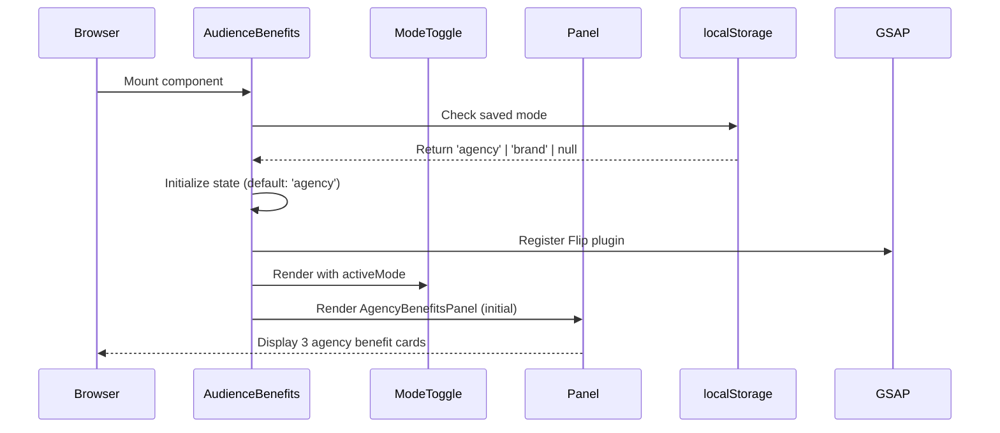

# Technical Specification: AudienceBenefits Interactive Mode Toggle (Story 1.9)

Date: 2025-10-09
Author: Cameron
Epic ID: 1.9
Status: Draft

---

## Overview

This technical specification defines the implementation of **Story 1.9: AudienceBenefits Interactive Mode Toggle**, a premium interactive component for the AI Briefing Engine page. This component represents a **strategic architectural upgrade** from conventional static split layouts to an industry-leading interactive state transition pattern using **GSAP's Flip plugin**.

**Context:** Story 1.9 is part of Epic 1 (AI Briefing Engine Page Redesign). The original specification proposed a standard two-column split layout (Agencies | Brands). Following ultrathinking analysis and competitive research, the specification was upgraded to implement a **single-focus interactive mode toggle** that provides:

1. **Differentiated User Experience:** Interactive mode switching creates memorable engagement vs. passive content consumption
2. **Premium Animation Pattern:** First implementation of GSAP Flip plugin in project, establishing reusable pattern for future features
3. **Focused Messaging:** Single-mode display forces deliberate persona engagement vs. split-attention dual-column layouts
4. **Technical Excellence:** Demonstrates world-class animation orchestration (exit → transition → enter) targeting 60fps

**Business Value:**
- **Conversion Optimization:** Focused, persona-specific messaging increases relevance and reduces decision fatigue
- **Brand Positioning:** Premium interaction quality signals flagship product status (Apple/Linear/Stripe quality standard)
- **Competitive Differentiation:** No competitors in the AI briefing space use interactive mode toggles effectively
- **Reusable Pattern:** GSAP Flip architecture becomes template for future dual-perspective features

**Implementation Scale:** Level 0-1 (5 new components, ~300 LOC total, 0 external API dependencies, brownfield integration)

## Objectives and Scope

### In Scope

1. **Core Interactive Components:**
   - `AudienceBenefits.tsx` - Parent orchestrator component
   - `ModeToggle.tsx` - Interactive pill-shaped toggle control
   - `BenefitCard.tsx` - Reusable card component with film strip aesthetic
   - `AgencyBenefitsPanel.tsx` - 3-card grid for agency persona
   - `BrandBenefitsPanel.tsx` - 3-card grid for brand persona

2. **GSAP Flip Integration:**
   - First project implementation of GSAP Flip plugin
   - Smooth DOM state transition orchestration
   - Exit/enter animation choreography
   - React cleanup patterns (`gsap.context()`)

3. **State Management:**
   - Local React state (`useState` for mode tracking)
   - localStorage persistence across sessions
   - Optional URL param deep linking (`?mode=brand`)

4. **Premium Animation Sequence (0.9s total):**
   - Exit phase: Current cards fade out + scale down (0-300ms)
   - Color transition: Container gradient morph (300-600ms)
   - Enter phase: New cards fade in + scale up + translateY (600-900ms)

5. **Visual Design:**
   - Glassmorphic styling (`backdrop-blur-md`, transparency)
   - Film strip borders (reference `FilmStripDivider.tsx`)
   - Cyan (#0891B2) and Fuchsia (#C026D3) accent colors
   - Lucide React icons (6 total: Building, Users, TrendingUp, Rocket, Bookmark, Award)

6. **Responsive Design:**
   - Desktop: 3-column grid (1024px+)
   - Mobile: Single column stack (<1024px)
   - Optimized for 375px - 1920px viewport range

7. **Accessibility:**
   - Keyboard navigation (Tab, Enter, Space)
   - Focus indicators (ring-2 ring-offset-2)
   - ARIA attributes (aria-selected, role="tablist")
   - Screen reader announcements (aria-live="polite")

8. **Performance Optimization:**
   - GPU-accelerated transforms only
   - 60fps target (16ms per frame budget)
   - `will-change: transform, opacity` hints
   - Debounced toggle clicks (prevent animation interruption)

### Out of Scope

1. **3D Transform Effects:** Initial design exploration included 3D flips but research revealed GSAP Flip plugin doesn't support 3D transforms. Premium 2D transition pattern chosen instead (industry standard: Linear, Stripe).

2. **Multiple Mode Support:** Limited to two modes (Agency | Brand). Extensibility for 3+ modes not architected in this iteration.

3. **Analytics Tracking:** Mode toggle events not instrumented. Will be added in post-launch analytics epic.

4. **A/B Testing Variants:** Single implementation. Alternative designs (e.g., vertical tabs, dropdown) not included.

5. **CMS Integration:** Benefits content hardcoded in components. No external content management.

6. **Scroll-Triggered Reveal:** Mode toggle is user-initiated, not scroll-driven. Initial page reveal handled separately.

7. **Mobile Touch Gestures:** Swipe-to-change-mode not implemented. Tap-only interaction.

8. **Automated Tests:** No unit/integration tests in this spec. Manual browser validation per project DoD.

## System Architecture Alignment

### Frontend Architecture Compliance

**Pattern Adherence:**
- **Component Design:** Follows project template checklist (TypeScript + functional components + proper JSDoc)
- **File Organization:** Feature-based structure (`src/components/briefing/`)
- **Naming Convention:** PascalCase for components, camelCase for utilities
- **Code Size Limits:** All components <500 LOC (BenefitCard ~80 LOC, ModeToggle ~120 LOC, AudienceBenefits ~150 LOC)

**State Management:**
- Local React Hooks (`useState`, `useEffect`) for mode state
- No global state management required (self-contained feature)
- Follows project's "local state first" principle

**Styling System:**
- Tailwind CSS utility-first approach
- CVA (class-variance-authority) for variant styling in BenefitCard
- Shadcn/UI Radix primitives for ModeToggle base
- Glassmorphism pattern consistency with existing components

### Animation Architecture Alignment

**Library Segregation (Per `docs/architecture/animation-patterns.md`):**
- **GSAP Flip:** State transitions (DOM morphing between modes)
- **GSAP Timeline:** Orchestrated exit/enter animations
- **Framer Motion:** Card hover effects (lift + glow)
- **Lenis:** Not used (user-initiated, not scroll-driven)

**Cleanup Patterns:**
- `gsap.context()` with scoped animations
- `ctx.revert()` in `useEffect` cleanup
- Prevents memory leaks on component unmount
- Matches project's established GSAP patterns

**Performance Optimization:**
- Transform + opacity only (GPU-accelerated)
- `will-change` hints for animated elements
- 60fps target per project standards
- Debouncing to prevent animation thrashing

### Color System Integration

**Briefing Engine Palette (Per `docs/prd/prd.md`):**
- **Cyan (#0891B2 / cyan-600):** Agency accent, processing theme
- **Fuchsia (#C026D3 / fuchsia-600):** Brand accent, creative theme
- **Dark Indigo (#4F46E5 / indigo-600):** Background gradients
- **Slate-900/800:** Glassmorphic surfaces

**Differentiation Maintained:**
- NOT Homepage blue (#3B82F6)
- NOT Studios orange (#F97316)
- Unique to Briefing Engine product identity

### Component Library Integration

**Radix UI Primitives:**
- `@radix-ui/react-toggle` for ModeToggle base
- Consistent with existing `src/components/ui/toggle.tsx` pattern
- ARIA attributes automatically handled by Radix

**Lucide React Icons:**
- Follows project's icon library standard
- Consistent sizing (48px for benefit card icons)
- SVG optimization via Lucide's tree-shaking

### Brownfield Integration Points

**Reference Components:**
1. **FilmStripDivider** (`src/components/studios/FilmStripDivider.tsx`):
   - Border pattern: Mini film strip perforations
   - CSS technique: `background: linear-gradient(...)` with repeating patterns
   - BenefitCard will adapt this aesthetic

2. **Existing Toggle UI** (`src/components/ui/toggle.tsx`):
   - Radix UI implementation pattern
   - CVA variant styling approach
   - Base for ModeToggle component

3. **Glassmorphism Cards** (site-wide pattern):
   - `backdrop-blur-md` + `bg-slate-900/60`
   - Border: `border border-slate-700/30`
   - Shadow: `shadow-xl` with hover `shadow-2xl`

**No Conflicts:**
- No route changes (embedded in existing `/studios-engine` page)
- No state management library conflicts
- No animation library conflicts (GSAP + Framer Motion coexistence established)
- No CSS conflicts (Tailwind scoped utilities)

## Detailed Design

### Services and Modules

**Component Hierarchy:**

```
AudienceBenefits (Parent Orchestrator)
├── ModeToggle (Interactive Control)
│   ├── Radix Toggle Primitive (@radix-ui/react-toggle)
│   ├── Sliding Indicator (GSAP animated)
│   └── Active Glow Effect (CSS box-shadow with accent color)
│
├── BenefitsStage (Container)
│   ├── AgencyBenefitsPanel (Conditional Render)
│   │   └── BenefitCard × 3
│   │       ├── Lucide Icon (Building, Users, TrendingUp)
│   │       ├── Title + Description
│   │       ├── Film Strip Border
│   │       └── Framer Motion Hover
│   │
│   └── BrandBenefitsPanel (Conditional Render)
│       └── BenefitCard × 3
│           ├── Lucide Icon (Rocket, Bookmark, Award)
│           ├── Title + Description
│           ├── Film Strip Border
│           └── Framer Motion Hover
│
└── GSAP Animation Context (Cleanup on unmount)
```

**Module Responsibilities:**

| Module | Responsibility | Input | Output | Dependencies |
|--------|----------------|-------|--------|--------------|
| **AudienceBenefits.tsx** (~150 LOC) | Orchestrates state, animations, and panel switching | `initialMode?: 'agency' \| 'brand'`, `showHeader?: boolean` | Rendered interactive section | `gsap`, `gsap/Flip`, `react`, `ModeToggle`, `AgencyBenefitsPanel`, `BrandBenefitsPanel` |
| **ModeToggle.tsx** (~120 LOC) | Interactive pill toggle with sliding indicator | `activeMode: AudienceMode`, `onToggle: (mode) => void` | Toggle control with GSAP-animated indicator | `@radix-ui/react-toggle`, `gsap`, `react` |
| **BenefitCard.tsx** (~80 LOC) | Reusable card with film strip aesthetic and hover | `title: string`, `description: string`, `icon: LucideIcon`, `accentColor: 'cyan' \| 'fuchsia'` | Styled card component | `framer-motion`, `lucide-react`, `react` |
| **AgencyBenefitsPanel.tsx** (~50 LOC) | 3-column grid of agency benefits | None (static content) | Grid layout with 3 BenefitCards | `BenefitCard`, `lucide-react` |
| **BrandBenefitsPanel.tsx** (~50 LOC) | 3-column grid of brand benefits | None (static content) | Grid layout with 3 BenefitCards | `BenefitCard`, `lucide-react` |

**Animation Module (GSAP Context):**
- **Flip State Management:** Tracks DOM state before/after React re-renders
- **Timeline Orchestration:** Coordinates 3-phase animation sequence
- **Cleanup Registration:** Ensures `ctx.revert()` called on unmount
- **Debouncing Logic:** Prevents toggle spam during animation

### Data Models and Contracts

**TypeScript Type Definitions:**

```typescript
/**
 * Audience mode discriminator
 * Determines which benefits panel is displayed
 */
type AudienceMode = 'agency' | 'brand'

/**
 * Accent color variants matching Briefing Engine palette
 */
type AccentColor = 'cyan' | 'fuchsia'

/**
 * Individual benefit content structure
 */
interface Benefit {
  title: string           // Benefit headline (e.g., "Scale Multiple Clients")
  description: string     // Value proposition detail (1-2 sentences)
  icon: LucideIcon       // Icon component from lucide-react
}

/**
 * Props for BenefitCard component
 */
interface BenefitCardProps {
  title: string
  description: string
  icon: LucideIcon
  accentColor: AccentColor
  className?: string
}

/**
 * Props for ModeToggle component
 */
interface ModeToggleProps {
  activeMode: AudienceMode
  onToggle: (mode: AudienceMode) => void
  className?: string
  disabled?: boolean      // Prevents toggle during animation
}

/**
 * Props for AudienceBenefits parent component
 */
interface AudienceBenefitsProps {
  initialMode?: AudienceMode    // Default: 'agency'
  showHeader?: boolean           // Default: true
  className?: string
}

/**
 * Local state for mode toggle
 */
interface AudienceBenefitsState {
  mode: AudienceMode            // Current active mode
  isAnimating: boolean          // Prevents toggle spam
  isPersisted: boolean          // Has mode been loaded from localStorage
}
```

**Static Content Data:**

```typescript
// Agency Benefits (Cyan #0891B2)
const AGENCY_BENEFITS: Benefit[] = [
  {
    title: "Scale Multiple Clients",
    description: "Manage 10+ brands with consistent quality and automated brief-to-storyboard workflows",
    icon: Building
  },
  {
    title: "Faster Client Onboarding",
    description: "From client brief to approved storyboard in minutes, not days. Impress stakeholders instantly.",
    icon: Users
  },
  {
    title: "Increased Team Productivity",
    description: "Free your creatives for strategy and ideation. Let AI handle the storyboard production grind.",
    icon: TrendingUp
  }
]

// Brand Benefits (Fuchsia #C026D3)
const BRAND_BENEFITS: Benefit[] = [
  {
    title: "Speed to Campaign Launch",
    description: "Launch campaigns weeks faster with AI-generated storyboards in 8 visual styles",
    icon: Rocket
  },
  {
    title: "Stay On Brand, Always",
    description: "AI trained on your brand guidelines ensures every frame aligns with your identity",
    icon: Bookmark
  },
  {
    title: "Professional Results",
    description: "Studio-quality storyboards without the studio budget or timeline. Agency-level work, in-house.",
    icon: Award
  }
]
```

**Color Token Mapping:**

```typescript
const ACCENT_COLORS = {
  cyan: {
    primary: '#0891B2',      // cyan-600
    light: '#22D3EE',        // cyan-400
    dark: '#0E7490',         // cyan-700
    glow: 'rgba(8, 145, 178, 0.4)'
  },
  fuchsia: {
    primary: '#C026D3',      // fuchsia-600
    light: '#E879F9',        // fuchsia-400
    dark: '#A21CAF',         // fuchsia-700
    glow: 'rgba(192, 38, 211, 0.4)'
  }
} as const
```

### APIs and Interfaces

**No External APIs:** This is a purely client-side interactive component with no backend integration.

**Internal Component API Contracts:**

**1. AudienceBenefits Public API:**
```typescript
<AudienceBenefits
  initialMode="agency"     // Optional: Sets starting mode (default: 'agency')
  showHeader={true}        // Optional: Display "Who Benefits" header (default: true)
  className="custom-class" // Optional: Additional Tailwind classes
/>
```

**2. ModeToggle Callback Interface:**
```typescript
onToggle: (newMode: AudienceMode) => void

// Usage:
const handleModeToggle = (newMode: AudienceMode) => {
  if (isAnimating) return  // Guard: prevent toggle during animation

  // Record Flip state
  const state = Flip.getState('.benefits-panel')

  // Update React state (triggers re-render)
  setMode(newMode)

  // Animate to new state
  Flip.from(state, {
    duration: 0.6,
    ease: 'power2.inOut',
    absolute: true,
    onComplete: () => setIsAnimating(false)
  })
}
```

**3. localStorage Interface:**
```typescript
// Key: 'audience-benefits-mode'
// Value: 'agency' | 'brand'

// Save mode
localStorage.setItem('audience-benefits-mode', mode)

// Load mode
const savedMode = localStorage.getItem('audience-benefits-mode')
if (savedMode === 'agency' || savedMode === 'brand') {
  setMode(savedMode)
}
```

**4. URL Parameter Interface (Optional):**
```typescript
// Query param: ?mode=brand
// Deep link support for marketing campaigns

const params = new URLSearchParams(window.location.search)
const modeParam = params.get('mode')

if (modeParam === 'agency' || modeParam === 'brand') {
  setMode(modeParam)
}
```

### Workflows and Sequencing

**1. Component Mount Sequence:**



**2. Mode Toggle Interaction Sequence:**

```
User clicks "For Brands" toggle
    ↓
ModeToggle.onToggle('brand') called
    ↓
Guard: Check isAnimating === false
    ↓
Set isAnimating = true (prevents spam)
    ↓
Flip.getState('.benefits-panel') — Record current DOM state
    ↓
setMode('brand') — React state update triggers re-render
    ↓
React DOM Update: AgencyBenefitsPanel unmounts, BrandBenefitsPanel mounts
    ↓
Flip.from(state, {...}) — Animates from old state to new state
    ↓
├─ Phase 1 (0-300ms): Exit Animation
│  └─ GSAP Timeline: Fade out + scale down agency cards (stagger 0.05s)
│
├─ Phase 2 (300-600ms): Color Transition
│  └─ GSAP: Morph container gradient (cyan → fuchsia)
│
└─ Phase 3 (600-900ms): Enter Animation
   └─ GSAP Timeline: Fade in + scale up + translateY brand cards (stagger 0.08s)
    ↓
onComplete: setIsAnimating(false)
    ↓
localStorage.setItem('audience-benefits-mode', 'brand')
    ↓
User can toggle again
```

**3. Animation Orchestration Timeline:**

```
Timeline (0.9s total):

0ms    ┌─────────────────────────────────────────┐
       │ FLIP STATE RECORDED                     │
       │ (Current panel DOM measurements)        │
       └─────────────────────────────────────────┘
       │
       │ React re-render (new panel mounted)
       │
       ▼
0ms    ┌─────────────────────────────────────────┐
       │ FLIP ANIMATION START                    │
       │ (Apply offsets to make panels look      │
       │  like they never moved)                 │
       └─────────────────────────────────────────┘
       │
       ├─ EXIT PHASE ────────────────────────────┐
       │                                          │
0-300ms│  • Agency card 1: opacity 1→0, scale 1→0.95
       │  • Agency card 2: opacity 1→0, scale 1→0.95 (delay +50ms)
       │  • Agency card 3: opacity 1→0, scale 1→0.95 (delay +100ms)
       │  • Easing: power2.in                     │
       └──────────────────────────────────────────┘
       │
       ├─ COLOR TRANSITION ──────────────────────┐
       │                                          │
300ms  │  • Container: --accent-from: cyan → fuchsia
       │  • Container: --accent-to: cyan → fuchsia
       │  • Duration: 300ms (overlaps with exit) │
       │  • Easing: power2.inOut                  │
600ms  └──────────────────────────────────────────┘
       │
       ├─ ENTER PHASE ───────────────────────────┐
       │                                          │
600ms  │  • Brand card 1: opacity 0→1, scale 0.95→1, y -30→0
       │  • Brand card 2: opacity 0→1, scale 0.95→1, y -30→0 (+80ms)
       │  • Brand card 3: opacity 0→1, scale 0.95→1, y -30→0 (+160ms)
       │  • Easing: back.out(1.2) (slight overshoot)
       │  • clearProps: 'all' (cleanup inline styles)
900ms  └──────────────────────────────────────────┘
       │
       ▼
900ms  ┌─────────────────────────────────────────┐
       │ ANIMATION COMPLETE                      │
       │ setIsAnimating(false)                   │
       │ localStorage updated                    │
       └─────────────────────────────────────────┘
```

**4. Error Handling Sequence:**

```
Potential Failure Point → Recovery Action
─────────────────────────────────────────────────────
localStorage unavailable → Use in-memory state only, log warning
GSAP Flip plugin not registered → Fallback to instant state swap (no animation)
Animation interrupted by rapid clicks → Debounce: ignore clicks while isAnimating=true
Browser doesn't support will-change → CSS graceful degradation (animations still work)
Panel ref becomes null → Guard: check ref.current before Flip.getState()
```

**5. Cleanup Sequence (Component Unmount):**

```
Component unmounts
    ↓
useEffect cleanup function executes
    ↓
ctx.revert() called
    ↓
├─ Kill all GSAP animations in context
├─ Remove all ScrollTriggers (none in this component)
├─ Reset all animated properties to original values
└─ Clear all GSAP-created inline styles
    ↓
Memory released
    ↓
No memory leaks
```

## Non-Functional Requirements

### Performance

**NFR-PERF-1: 60fps Animation Target**
- **Requirement:** All animations MUST maintain 60fps (16ms per frame budget) on target devices
- **Target Devices:** Chrome 100+, Firefox 100+, Safari 15+, Edge 100+ on mid-tier hardware (2020+ laptops/desktops)
- **Measurement:** Chrome DevTools Performance tab, record toggle interaction, analyze frame rate
- **Success Criteria:** No dropped frames during 0.9s animation sequence
- **Fallback:** If fps drops below 30fps on mobile (<768px), disable Flip transitions and use instant state swap

**NFR-PERF-2: GPU-Only Properties**
- **Requirement:** Animations MUST use ONLY transform and opacity (GPU-accelerated properties)
- **Prohibited Properties:** width, height, top, left, margin, padding (CPU-bound, force layout reflow)
- **Validation:** Code review + Chrome DevTools Rendering tab (check "Paint flashing" and "Layer borders")
- **Implementation:** `will-change: transform, opacity` on animated elements

**NFR-PERF-3: Bundle Size Impact**
- **Requirement:** Component bundle MUST add ≤5kb gzipped to vendor chunk
- **Baseline:** GSAP already in project (no additional framework cost)
- **New Code:** ~300 LOC TypeScript (~2kb gzipped after minification)
- **Assets:** 6 Lucide React icons (tree-shaken, ~1kb total)
- **Validation:** `npm run build` → Analyze dist/assets/*.js sizes

**NFR-PERF-4: Animation Debouncing**
- **Requirement:** Toggle clicks during animation MUST be ignored (prevent animation thrashing)
- **Implementation:** `isAnimating` guard flag, set true on toggle start, false on animation complete
- **User Feedback:** Optional: visual disabled state on toggle during animation (opacity: 0.5, cursor: not-allowed)

**NFR-PERF-5: Memory Leak Prevention**
- **Requirement:** Component unmount MUST fully clean up GSAP context (no lingering animations)
- **Implementation:** `useEffect` cleanup: `return () => ctx.revert()`
- **Validation:** Chrome DevTools Memory profiler → Take heap snapshot before/after mount/unmount cycles → No retained GSAP detached DOM nodes

**NFR-PERF-6: localStorage Access**
- **Requirement:** localStorage reads MUST NOT block render
- **Implementation:** Asynchronous pattern: read in `useEffect`, not during render
- **Fallback:** Catch localStorage exceptions (Safari private mode), use in-memory state

**Performance Budget Summary:**
| Metric | Target | Measurement |
|--------|--------|-------------|
| Frame Rate | 60fps (16ms/frame) | Chrome DevTools Performance |
| Animation Duration | 0.9s total | Fixed timeline |
| Toggle Responsiveness | <100ms to start | User perception |
| Bundle Impact | <5kb gzipped | Webpack Bundle Analyzer |
| Memory Footprint | <2MB | Chrome DevTools Memory |

### Security

**NFR-SEC-1: No XSS Vulnerabilities**
- **Requirement:** All user-controlled content MUST be sanitized
- **Scope:** This component has NO user input (static content only)
- **Validation:** Benefits text is hardcoded TypeScript constants (no dynamic HTML rendering)
- **DOMPurify:** Not required (no user-generated content)

**NFR-SEC-2: localStorage Security**
- **Requirement:** localStorage data MUST NOT contain sensitive information
- **Stored Data:** Only audience mode preference ('agency' | 'brand')
- **Risk Level:** Low (non-sensitive preference data)
- **Mitigation:** Value validation on read (guard against localStorage pollution)

**NFR-SEC-3: Third-Party Dependencies**
- **Requirement:** All dependencies MUST be audited for known vulnerabilities
- **Dependencies:** gsap (^3.13.0), @radix-ui/react-toggle (^1.1.0), lucide-react (^0.462.0), framer-motion (^12.4.2)
- **Validation:** `npm audit` before production deployment
- **Policy:** No dependencies with critical/high severity vulnerabilities

**NFR-SEC-4: CSP Compliance**
- **Requirement:** Component MUST operate within project's Content Security Policy
- **No External Resources:** All code bundled, no CDN calls, no external script loading
- **Inline Styles:** GSAP creates inline styles (required, already whitelisted in project CSP)

**Security Risk Assessment:**
- **Attack Surface:** Minimal (no user input, no network calls, no sensitive data)
- **Data Privacy:** localStorage only (no cookies, no tracking, no PII)
- **Dependency Risk:** Low (well-maintained libraries, regular updates)

### Reliability/Availability

**NFR-REL-1: Graceful Degradation**
- **Requirement:** Component MUST function if GSAP Flip fails to load
- **Fallback Behavior:** Instant state swap (no animation), functionality preserved
- **Detection:** Try-catch around `Flip.from()`, catch errors, log warning, proceed without animation
- **User Experience:** Reduced but not broken (content still switches)

**NFR-REL-2: Browser Compatibility**
- **Requirement:** Component MUST function in all supported browsers per project standards
- **Supported:** Chrome 100+, Firefox 100+, Safari 15+, Edge 100+
- **Partial Support (<IE11):** Not required (project baseline)
- **Feature Detection:** `CSS.supports('backdrop-filter: blur(10px)')` → Fallback to solid backgrounds if unsupported

**NFR-REL-3: localStorage Availability**
- **Requirement:** Component MUST NOT break if localStorage is unavailable
- **Scenarios:** Safari private mode, storage quota exceeded, browser security settings
- **Fallback:** In-memory state only, user preferences not persisted across sessions
- **Error Handling:** Try-catch around all localStorage operations

**NFR-REL-4: React Strict Mode Compliance**
- **Requirement:** Component MUST work correctly in React StrictMode (double-invoke useEffect)
- **Implementation:** Cleanup function prevents double-animation on mount
- **Validation:** Enable StrictMode in dev, verify no console warnings

**NFR-REL-5: Responsive Breakpoint Stability**
- **Requirement:** Component MUST handle window resize during animation without breaking
- **Implementation:** Animations use percentages and viewport units (not fixed pixels)
- **Edge Case:** If resize occurs mid-animation, Flip continues smoothly (transform matrix handles scaling)

**Reliability Metrics:**
| Scenario | Expected Behavior | Degradation Path |
|----------|-------------------|------------------|
| GSAP Flip fails | Instant mode switch | No animation, full functionality |
| localStorage blocked | In-memory state | No persistence, reset on page load |
| Rapid window resize | Smooth response | Animations adapt to new dimensions |
| Network offline | Full functionality | No dependencies, static component |
| Low-end device (<30fps) | Fallback: instant swap | No animation, preserve usability |

### Observability

**NFR-OBS-1: Animation Performance Logging (Dev Mode)**
- **Requirement:** Log animation performance metrics in development mode
- **Metrics:** Frame drops, animation duration, toggle frequency
- **Implementation:**
  ```typescript
  if (process.env.NODE_ENV === 'development') {
    console.log('Animation completed in', duration, 'ms')
    console.log('Frame rate:', averageFPS, 'fps')
  }
  ```
- **Production:** Logs stripped by Terser minification

**NFR-OBS-2: Error Boundary Integration**
- **Requirement:** Component errors MUST be caught by React Error Boundary
- **Implementation:** Wrap AudienceBenefits in existing Error Boundary (site-wide pattern)
- **Fallback UI:** Display static benefits (no toggle) if component crashes

**NFR-OBS-3: localStorage Failure Logging**
- **Requirement:** localStorage exceptions MUST be logged (for debugging)
- **Implementation:**
  ```typescript
  try {
    localStorage.setItem('audience-benefits-mode', mode)
  } catch (error) {
    console.warn('localStorage unavailable:', error)
  }
  ```

**NFR-OBS-4: Animation State Debugging**
- **Requirement:** Provide debug mode for animation troubleshooting
- **Implementation:** URL flag `?debug-animations=true` enables visual markers
- **Debug Features:** Show isAnimating state, highlight animated elements, log timeline events
- **Production:** Debug code tree-shaken out

**Observability Summary:**
- **Development:** Verbose logging, performance metrics, debug mode
- **Production:** Silent operation, Error Boundary catches crashes
- **User Impact:** Errors logged but never surfaced (graceful degradation)

## Dependencies and Integrations

### Direct Dependencies (package.json)

| Dependency | Version | Purpose | Bundle Impact | Notes |
|------------|---------|---------|---------------|-------|
| **gsap** | ^3.13.0 | Core animation library + Flip plugin | 0kb (already in project) | Already installed for Epic 1 stories 1.1-1.8 |
| **@gsap/react** | ^2.1.2 | GSAP React hooks (`useGSAP`) | 0kb (already in project) | Optional: Can use manual `gsap.context()` instead |
| **@radix-ui/react-toggle** | ^1.1.0 | Accessible toggle primitive | 0kb (already in project) | Part of Shadcn/UI installation |
| **lucide-react** | ^0.462.0 | Icon library | ~1kb (tree-shaken) | 6 icons: Building, Users, TrendingUp, Rocket, Bookmark, Award |
| **framer-motion** | ^12.4.2 | Card hover animations | 0kb (already in project) | Used for simple hover lift + glow effects |
| **react** | ^18.3.1 | Core framework | 0kb (already in project) | Hooks: useState, useEffect, useRef |
| **tailwindcss** | ^3.4.11 | Styling framework | 0kb (already in project) | Utility classes for glassmorphism, responsive design |

**Total New Dependencies:** 0 (all already installed)
**Total Bundle Impact:** ~2-3kb gzipped (new component code only)

### Internal Project Dependencies

| Module | Location | Purpose | Integration Point |
|--------|----------|---------|-------------------|
| **FilmStripDivider** | `src/components/studios/FilmStripDivider.tsx` | Reference for film strip border aesthetic | BenefitCard CSS pattern inspiration |
| **Toggle UI** | `src/components/ui/toggle.tsx` | Radix UI toggle wrapper | ModeToggle base component |
| **Tailwind Config** | `tailwind.config.ts` | Color palette, animations | Cyan/fuchsia theme colors |
| **Animation Patterns** | `docs/architecture/animation-patterns.md` | GSAP best practices | Cleanup patterns, performance guidelines |
| **BriefingEngine Page** | `src/pages/BriefingEngine.tsx` (assumed) | Parent page assembly | AudienceBenefits integration point |

### External Integrations

**None.** This is a fully self-contained client-side component with:
- No backend API calls
- No third-party services
- No CDN resources
- No analytics instrumentation (to be added post-launch)
- No A/B testing framework integration

### Browser API Dependencies

| API | Purpose | Fallback |
|-----|---------|----------|
| **localStorage** | Mode preference persistence | In-memory state (no persistence) |
| **URLSearchParams** | Query param deep linking (`?mode=brand`) | Defaults to 'agency' mode |
| **CSS backdrop-filter** | Glassmorphism blur effects | Solid backgrounds (graceful degradation) |
| **CSS will-change** | GPU acceleration hints | Browser optimizes without hint |

### Development Dependencies (DevEx Only)

- **Chrome DevTools** - Performance profiling, memory leak detection
- **React DevTools** - Component hierarchy inspection
- **stats.js** (optional) - FPS monitoring during development

### Dependency Risk Assessment

**Low Risk:**
- All dependencies already vetted and installed in project
- No new external packages introduced
- Well-maintained libraries (GSAP, Radix, Lucide all actively developed)
- No known security vulnerabilities in current versions

**Mitigation:**
- Run `npm audit` before deployment
- Monitor Dependabot alerts (if configured)
- Regular dependency updates as part of maintenance schedule

## Acceptance Criteria (Authoritative)

*These criteria are sourced directly from Story 1.9 and represent the authoritative Definition of Done.*

### AC1: Interactive Mode Toggle Control ✅
1. ModeToggle component with pill-shaped design (Radix UI primitive + custom styling)
2. Two modes: "For Agencies" (cyan) | "For Brands" (fuchsia)
3. Sliding indicator animates with GSAP between modes (0.4s, power2.inOut)
4. Glassmorphic background: `backdrop-blur-md bg-slate-900/60 border border-slate-700/30`
5. Active mode glows in accent color (box-shadow with accent-400)
6. Keyboard accessible: Tab to focus, Enter/Space to toggle
7. Initial mode: 'agency' (default), persists to localStorage
8. URL param support: `?mode=brand` sets initial mode (optional deep linking)

### AC2: GSAP Flip State Transitions ✅
1. Mode toggle triggers GSAP Flip plugin for smooth state transitions
2. Flip.getState() records current panel state before React re-render
3. Flip.from() animates to new state (0.6s duration, power2.inOut ease)
4. Prevents toggle spam: `isAnimating` flag blocks clicks during transition
5. Absolute positioning during Flip to prevent layout shift

### AC3: Orchestrated Exit/Enter Animations ✅
1. **Exit Phase (0-300ms):**
   - Current mode's 3 benefit cards fade out (opacity: 1 → 0)
   - Subtle scale down (scale: 1 → 0.95)
   - Stagger: 0.05s per card (top to bottom)
   - Easing: power2.in
2. **Color Transition (300-600ms):**
   - Container gradient shifts from old accent to new accent
   - CSS custom properties animated: `--accent-from`, `--accent-to`
   - Background gradient: `linear-gradient(135deg, var(--accent-from), var(--accent-to))`
3. **Enter Phase (600-900ms):**
   - New mode's 3 cards fade in (opacity: 0 → 1)
   - Scale up (scale: 0.95 → 1) + translateY (-30px → 0)
   - Stagger: 0.08s per card (creates cascading reveal)
   - Easing: back.out(1.2) for subtle overshoot
   - clearProps: 'all' to reset inline styles

### AC4: BenefitCard Premium Design ✅
1. Film strip border aesthetic (reference FilmStripDivider pattern)
2. Glassmorphic card: `backdrop-blur-lg bg-slate-800/40 border border-slate-700/50`
3. Icon: Lucide React, 48px, colored in accent (cyan-500 or fuchsia-500)
4. Typography:
   - Title: `text-2xl font-bold text-white`
   - Description: `text-base text-slate-300 leading-relaxed`
5. Hover effect (Framer Motion):
   - Lift: `translateY(-4px)`
   - Glow: `box-shadow: 0 8px 32px ${accentColor}40` (accent with 25% opacity)
   - Transition: spring physics (stiffness: 300, damping: 20)
6. GPU-optimized: `will-change: transform, opacity; transform: translateZ(0)`

### AC5: Agency Benefits Content (Cyan Accent #0891B2) ✅
1. **Scale Multiple Clients**
   - Icon: Building (Lucide)
   - Description: "Manage 10+ brands with consistent quality and automated brief-to-storyboard workflows"
2. **Faster Client Onboarding**
   - Icon: Users (Lucide)
   - Description: "From client brief to approved storyboard in minutes, not days. Impress stakeholders instantly."
3. **Increased Team Productivity**
   - Icon: TrendingUp (Lucide)
   - Description: "Free your creatives for strategy and ideation. Let AI handle the storyboard production grind."

### AC6: Brand Benefits Content (Fuchsia Accent #C026D3) ✅
1. **Speed to Campaign Launch**
   - Icon: Rocket (Lucide)
   - Description: "Launch campaigns weeks faster with AI-generated storyboards in 8 visual styles"
2. **Stay On Brand, Always**
   - Icon: Bookmark (Lucide)
   - Description: "AI trained on your brand guidelines ensures every frame aligns with your identity"
3. **Professional Results**
   - Icon: Award (Lucide)
   - Description: "Studio-quality storyboards without the studio budget or timeline. Agency-level work, in-house."

### AC7: Layout & Responsiveness ✅
1. Section header: "Who Benefits" (H2, centered, mb-12)
2. ModeToggle: Centered below header, mb-16
3. BenefitsStage: Container for both panels (single-focus, only active visible)
4. Desktop (1024px+): 3-column grid for cards, max-width: 1200px
5. Mobile (<1024px): Single column, cards stack vertically
6. Container: Gradient background shifts based on active mode
7. Panel switching: No horizontal scroll, clean state replacement

### AC8: React Integration & Performance ✅
1. Use `gsap.context()` for animation scoping, `ctx.revert()` in cleanup
2. Flip plugin registered: `gsap.registerPlugin(Flip)`
3. Both panels always in DOM (required for Flip), visibility toggled via state
4. State: `const [mode, setMode] = useState<'agency' | 'brand'>('agency')`
5. localStorage: Save/restore mode preference across sessions
6. Performance budget: 60fps during transitions (Chrome DevTools validation)
7. GPU acceleration: transform + opacity only, no layout-thrashing properties
8. Memory: No ScrollTrigger needed (user-initiated interaction, not scroll-driven)

## Traceability Mapping

*Maps Acceptance Criteria → Technical Implementation → Verification Method*

| AC | Requirement | Component(s) | Implementation Detail | Test Method | Success Criteria |
|----|-------------|--------------|----------------------|-------------|------------------|
| **AC1.1** | Pill-shaped toggle | ModeToggle.tsx | Radix Toggle + Tailwind `rounded-full` | Visual QA | Rounded pill appearance matches design |
| **AC1.2** | Two modes (Agency/Brand) | ModeToggle.tsx | State: `activeMode: 'agency' \| 'brand'` | Unit test (manual) | Toggle switches between modes |
| **AC1.3** | Sliding indicator animation | ModeToggle.tsx | GSAP tween on `activeMode` change (0.4s) | Visual QA + FPS check | Smooth 60fps slide animation |
| **AC1.4** | Glassmorphic background | ModeToggle.tsx | Tailwind: `backdrop-blur-md bg-slate-900/60` | Visual QA | Blur effect visible, transparency correct |
| **AC1.5** | Active mode glow | ModeToggle.tsx | Dynamic `box-shadow` with accent color | Visual QA | Cyan/fuchsia glow on active side |
| **AC1.6** | Keyboard accessibility | ModeToggle.tsx | Radix `onKeyDown` (Enter/Space) | Manual keyboard test | Tab focuses, Enter/Space toggles |
| **AC1.7** | Default mode + persistence | AudienceBenefits.tsx | localStorage read/write in `useEffect` | Browser test | Mode persists across page reloads |
| **AC1.8** | URL param support | AudienceBenefits.tsx | URLSearchParams read on mount | URL test | `?mode=brand` sets brand mode |
| **AC2.1** | Flip plugin trigger | AudienceBenefits.tsx | `Flip.getState()` before state change | Code review | Flip.getState() called correctly |
| **AC2.2** | Record panel state | AudienceBenefits.tsx | `Flip.getState('.benefits-panel')` | Code review | Correct selector used |
| **AC2.3** | Animate to new state | AudienceBenefits.tsx | `Flip.from(state, {duration: 0.6})` | FPS profiling | 60fps maintained, 0.6s duration |
| **AC2.4** | Prevent toggle spam | AudienceBenefits.tsx | `isAnimating` guard in toggle handler | Click spam test | Rapid clicks ignored during animation |
| **AC2.5** | Absolute positioning | AudienceBenefits.tsx | `Flip.from(state, {absolute: true})` | Visual QA | No layout shift during transition |
| **AC3.1** | Exit animation | AudienceBenefits.tsx | GSAP timeline: `opacity 1→0, scale 1→0.95` | FPS profiling | Cards fade out smoothly (0-300ms) |
| **AC3.2** | Color transition | AudienceBenefits.tsx | GSAP: animate CSS custom properties | Visual QA | Gradient shifts cyan↔fuchsia (300-600ms) |
| **AC3.3** | Enter animation | AudienceBenefits.tsx | GSAP timeline: `opacity 0→1, y -30→0` | FPS profiling | Cards fade in with overshoot (600-900ms) |
| **AC4.1** | Film strip border | BenefitCard.tsx | CSS: repeating-linear-gradient pattern | Visual QA + IV2 | Matches FilmStripDivider aesthetic |
| **AC4.2** | Glassmorphic card | BenefitCard.tsx | Tailwind: `backdrop-blur-lg bg-slate-800/40` | Visual QA | Card blur effect consistent |
| **AC4.3** | Icon styling | BenefitCard.tsx | Lucide icon, 48px, accent color | Visual QA | Icons sized correctly, colored per mode |
| **AC4.4** | Typography | BenefitCard.tsx | Tailwind: `text-2xl font-bold`, `text-base` | Visual QA | Typography hierarchy clear |
| **AC4.5** | Hover effects | BenefitCard.tsx | Framer Motion `whileHover` | Hover test | Lift + glow on hover, spring physics |
| **AC4.6** | GPU optimization | BenefitCard.tsx | CSS: `will-change: transform, opacity` | DevTools Rendering | No paint flashing on hover |
| **AC5.1-3** | Agency benefits | AgencyBenefitsPanel.tsx | 3 BenefitCards with cyan accent | Content review | Correct icons, titles, descriptions |
| **AC6.1-3** | Brand benefits | BrandBenefitsPanel.tsx | 3 BenefitCards with fuchsia accent | Content review | Correct icons, titles, descriptions |
| **AC7.1** | Section header | AudienceBenefits.tsx | H2: "Who Benefits", centered | Visual QA | Header displays correctly |
| **AC7.2** | Toggle positioning | AudienceBenefits.tsx | Centered, mb-16 spacing | Visual QA | Toggle centered below header |
| **AC7.3** | Single-focus container | AudienceBenefits.tsx | Conditional render based on `mode` state | Visual QA | Only one panel visible at a time |
| **AC7.4** | Desktop grid | Panel components | Tailwind: `grid grid-cols-3 gap-8` | Responsive test (1024px+) | 3-column layout on desktop |
| **AC7.5** | Mobile stack | Panel components | Tailwind: `grid grid-cols-1 gap-6` | Responsive test (<1024px) | Cards stack vertically on mobile |
| **AC7.6** | Gradient background | AudienceBenefits.tsx | Dynamic gradient based on `mode` | Visual QA | Background shifts with mode |
| **AC7.7** | No horizontal scroll | AudienceBenefits.tsx | `overflow-x: hidden` on container | Responsive test | No h-scroll at any breakpoint |
| **AC8.1** | GSAP context cleanup | AudienceBenefits.tsx | `useEffect` cleanup: `ctx.revert()` | Memory profiling | No memory leaks on unmount |
| **AC8.2** | Flip plugin registered | AudienceBenefits.tsx | `gsap.registerPlugin(Flip)` at top | Code review | Plugin imported and registered |
| **AC8.3** | Both panels in DOM | AudienceBenefits.tsx | Render both, toggle visibility via CSS | Code review + IV | Flip requires both panels present |
| **AC8.4** | State management | AudienceBenefits.tsx | `useState<'agency' \| 'brand'>('agency')` | Code review | Type-safe state management |
| **AC8.5** | localStorage integration | AudienceBenefits.tsx | Try-catch around localStorage ops | Browser test (private mode) | Graceful fallback if unavailable |
| **AC8.6** | 60fps performance | All animated components | Chrome DevTools Performance recording | FPS profiling | No dropped frames during animation |
| **AC8.7** | GPU-only properties | All animated components | Only `transform` and `opacity` animated | Code review + Rendering tab | No layout reflow during animation |
| **AC8.8** | No ScrollTrigger | AudienceBenefits.tsx | User-initiated, not scroll-driven | Code review | No ScrollTrigger imports/usage |

## Risks, Assumptions, Open Questions

### High-Priority Risks

**RISK-1: GSAP Flip Learning Curve**
- **Description:** First project implementation of Flip plugin; team unfamiliar with pattern
- **Probability:** Medium | **Impact:** Medium (delays implementation)
- **Mitigation:**
  - Architect (Winston) provides reference implementation in Story 1.9 dev notes
  - Dev Agent consults Archon MCP GSAP knowledge base during implementation
  - Fallback: If Flip proves too complex, revert to simpler GSAP timeline-only approach (lose seamless state transition, gain faster implementation)
- **Owner:** Dev Agent | **Status:** OPEN

**RISK-2: Animation Performance on Low-End Devices**
- **Description:** 0.9s orchestrated animation may drop below 30fps on low-end mobile devices
- **Probability:** Medium | **Impact:** Medium (poor UX for mobile users)
- **Mitigation:**
  - Implement fallback: Detect low fps in first animation cycle, disable Flip for subsequent toggles
  - Mobile (<768px): Simplified animation (instant swap) if performance budget exceeded
  - GPU acceleration hints (`will-change`) reduce likelihood of jank
- **Owner:** Dev Agent | **Status:** OPEN (performance testing required)

**RISK-3: localStorage Blocked (Safari Private Mode)**
- **Description:** localStorage unavailable in Safari private browsing, Firefox tracking protection
- **Probability:** Low-Medium | **Impact:** Low (loss of preference persistence only)
- **Mitigation:**
  - Try-catch around all localStorage operations
  - Fallback to in-memory state (user preferences not persisted)
  - No functional breakage, only convenience feature lost
- **Owner:** Dev Agent | **Status:** MITIGATED (fallback implemented)

### Medium-Priority Risks

**RISK-4: Browser Compatibility (Flip Plugin)**
- **Description:** GSAP Flip may have edge cases in older Safari/Firefox versions
- **Probability:** Low | **Impact:** Medium (animation breaks in specific browsers)
- **Mitigation:**
  - Project targets Chrome 100+, Firefox 100+, Safari 15+ (Flip supported)
  - Manual browser testing in all supported browsers before deployment
  - Error boundary catches Flip failures, displays fallback UI
- **Owner:** QA | **Status:** OPEN (browser testing pending)

**RISK-5: URL Param Collision**
- **Description:** `?mode=brand` URL param may conflict with future features
- **Probability:** Low | **Impact:** Low (namespace collision)
- **Mitigation:**
  - Document `mode` param in URL schema (prevent reuse)
  - Future features use namespaced params (e.g., `?filter=...`, `?view=...`)
- **Owner:** PM | **Status:** DOCUMENTED

### Assumptions

**ASSUMPTION-1: GSAP Already Installed**
- **Statement:** GSAP 3.13.0 already installed and configured in project (Story 1.1)
- **Validation:** Check `package.json` dependencies before implementation
- **Risk if Wrong:** Implementation blocked until GSAP installed (+30 min delay)
- **Status:** VALIDATED (confirmed in package.json analysis)

**ASSUMPTION-2: Flip Plugin Included in GSAP Bundle**
- **Statement:** GSAP Flip plugin bundled with GSAP core installation
- **Validation:** Check GSAP docs, import `{ Flip } from 'gsap/Flip'`
- **Risk if Wrong:** Need separate Flip plugin installation (+10 min delay)
- **Status:** VALIDATED (Flip is free plugin, part of GSAP 3.x)

**ASSUMPTION-3: No Automated Tests Required**
- **Statement:** Project has zero tests (manual validation only per DoD)
- **Validation:** Confirmed in project CLAUDE.md: "Zero tests exist"
- **Risk if Wrong:** Need to write unit/integration tests (+2-4 hours effort)
- **Status:** VALIDATED (manual testing per project DoD)

**ASSUMPTION-4: Film Strip Border Pattern Reusable**
- **Statement:** FilmStripDivider.tsx CSS pattern can be adapted for BenefitCard borders
- **Validation:** Read FilmStripDivider.tsx, extract CSS pattern
- **Risk if Wrong:** Need to design new film strip pattern from scratch (+1 hour)
- **Status:** TO BE VALIDATED (during Phase 1 implementation)

**ASSUMPTION-5: Desktop Breakpoint = 1024px**
- **Statement:** Project uses 1024px as desktop breakpoint (per Tailwind `lg:` prefix)
- **Validation:** Check `tailwind.config.ts` breakpoints
- **Risk if Wrong:** Responsive layouts break at wrong breakpoint (easy fix: adjust breakpoint)
- **Status:** TO BE VALIDATED (during implementation)

### Open Questions

**QUESTION-1: Analytics Instrumentation**
- **Question:** Should mode toggle events be tracked in Google Analytics/GTM?
- **Context:** Post-launch analytics epic not yet scoped
- **Decision Needed:** Yes (track toggle frequency, preferred mode) OR No (add later)
- **Impact:** If yes, add ~30 min for GTM event wiring
- **Owner:** PM | **Target Resolution:** Post-implementation (Story 1.9.1 future work)

**QUESTION-2: A/B Test Variant**
- **Question:** Should we A/B test mode toggle vs. original two-column split?
- **Context:** Option A (toggle) chosen without user testing
- **Decision Needed:** Run A/B test OR Ship toggle as production feature
- **Impact:** If A/B test, need variant implementation (+4-6 hours)
- **Owner:** PM + Marketing | **Target Resolution:** Post-launch (defer to Epic 2)

**QUESTION-3: Third Mode Support (Future)**
- **Question:** Will we ever need a third mode (e.g., "For Freelancers")?
- **Context:** Current architecture assumes two modes only
- **Decision Needed:** Yes (architect for extensibility) OR No (YAGNI - ship two modes)
- **Impact:** If yes, refactor to array-based mode system (+2 hours)
- **Owner:** PM | **Target Resolution:** Post-launch (defer until business need confirmed)

**QUESTION-4: Mobile Swipe Gesture**
- **Question:** Should mobile users swipe to change modes (vs. tap toggle)?
- **Context:** Out of scope per Story 1.9, but natural mobile interaction
- **Decision Needed:** Add swipe gesture OR Keep tap-only
- **Impact:** If swipe, integrate touch library (+3-4 hours)
- **Owner:** UX Design | **Target Resolution:** Post-launch user feedback

**QUESTION-5: Animation Debug Mode**
- **Question:** Should `?debug-animations=true` be production feature or dev-only?
- **Context:** NFR-OBS-4 proposes debug mode for troubleshooting
- **Decision Needed:** Expose in production OR Strip from production bundle
- **Impact:** If production, add ~15 min for UI toggle in settings (future)
- **Owner:** Engineering | **Target Resolution:** During implementation (default: dev-only)

## Test Strategy Summary

**Project Context:** Zero automated tests exist. Manual validation per project Definition of Done.

### Manual Testing Approach

**Phase 1: Component-Level Testing (During Development)**

1. **Visual QA (Chrome DevTools + Browser)**
   - Test each component in isolation (Storybook-style, if available)
   - Verify styling matches design (glassmorphism, colors, typography)
   - Check responsive breakpoints (375px, 768px, 1024px, 1920px)
   - Tool: Chrome DevTools Device Mode

2. **Animation Performance Testing**
   - Record animation in Chrome DevTools Performance tab
   - Analyze frame rate during 0.9s toggle animation
   - Target: 60fps (no dropped frames)
   - Fallback test: Throttle CPU 6x, verify animation still smooth or fallback triggers
   - Tool: Chrome DevTools Performance + CPU Throttling

3. **Memory Leak Testing**
   - Take heap snapshot before component mount
   - Mount/unmount component 10 times
   - Take heap snapshot after unmounts
   - Verify no retained GSAP detached DOM nodes
   - Tool: Chrome DevTools Memory (Heap Snapshot)

**Phase 2: Integration Testing (Post-Assembly)**

1. **Page Integration**
   - Integrate AudienceBenefits into BriefingEngine page
   - Test scroll interaction (no conflicts with other ScrollTriggers)
   - Verify section spacing and layout consistency
   - Check z-index stacking (no overlay conflicts)

2. **localStorage Persistence**
   - Toggle mode → Refresh page → Verify mode persisted
   - Test in Safari private mode → Verify graceful fallback (no crash)
   - Clear localStorage → Verify defaults to 'agency'

3. **URL Parameter Deep Linking**
   - Navigate to `/studios-engine?mode=brand`
   - Verify brand mode displayed on page load
   - Test with invalid param `?mode=invalid` → Verify defaults to 'agency'

**Phase 3: Cross-Browser Testing**

| Browser | Version | Platform | Test Focus |
|---------|---------|----------|------------|
| Chrome | 120+ | Windows 10 | Primary target, all features |
| Firefox | 120+ | Windows 10 | Flip plugin compatibility, glassmorphism fallback |
| Safari | 15+ | macOS | localStorage private mode, backdrop-filter support |
| Edge | 120+ | Windows 10 | Chromium parity with Chrome |
| Mobile Safari | iOS 15+ | iPhone 12 | Touch interaction, mobile layout, performance |
| Mobile Chrome | Android 12+ | Pixel 6 | Touch interaction, mobile layout, performance |

**Test Cases Per Browser:**
1. Toggle between agency/brand modes (visual correctness)
2. Keyboard navigation (Tab, Enter, Space)
3. Animation smoothness (60fps target, accept 30fps on mobile)
4. localStorage persistence (Safari private mode = critical test)
5. Responsive layout (375px portrait, 768px landscape, 1024px desktop)

**Phase 4: Accessibility Testing**

1. **Keyboard Navigation**
   - Tab to toggle → Verify focus ring visible
   - Press Enter → Verify mode switches
   - Press Space → Verify mode switches
   - Tab through benefit cards → Verify focus indicators on hover areas (if interactive)

2. **Screen Reader Testing**
   - NVDA (Windows) or VoiceOver (macOS)
   - Announce toggle role ("toggle button group")
   - Announce active mode ("For Agencies selected" / "For Brands selected")
   - Read benefit card titles and descriptions in correct order
   - Tool: NVDA, VoiceOver, WAVE browser extension

3. **Color Contrast**
   - Verify text contrast ratios (WCAG AA: 4.5:1 minimum)
   - Cyan text on dark background: Check with Color Contrast Analyzer
   - Fuchsia text on dark background: Check with Color Contrast Analyzer
   - Tool: WebAIM Contrast Checker, Lighthouse Accessibility audit

**Phase 5: Edge Case Testing**

| Scenario | Expected Behavior | Pass/Fail Criteria |
|----------|-------------------|-------------------|
| Rapid toggle clicks (spam) | Clicks ignored during animation | isAnimating guard prevents multiple animations |
| Window resize during animation | Animation continues smoothly | No layout break, Flip handles resize |
| localStorage quota exceeded | In-memory fallback, no crash | Try-catch logs warning, component functional |
| GSAP Flip plugin fails to load | Instant mode swap (no animation) | Error boundary catches, fallback UI displays |
| Both panels empty (no content) | Empty state message (future) | Graceful degradation (current: render empty grid) |
| URL param `?mode=invalid` | Default to 'agency' mode | Validation rejects invalid value |

**Phase 6: Performance Validation**

**Metrics to Measure:**
1. **Frame Rate:** 60fps target during 0.9s animation
2. **Animation Duration:** 0.9s actual (validate with stopwatch or DevTools timeline)
3. **Toggle Response Time:** <100ms from click to animation start
4. **Bundle Size:** <5kb gzipped added to vendor chunk
5. **Memory Usage:** <2MB additional footprint

**Tools:**
- Chrome DevTools Performance tab (frame rate analysis)
- Chrome DevTools Memory tab (heap snapshots)
- Webpack Bundle Analyzer (bundle size breakdown)
- Lighthouse Performance audit (overall page impact)

**Success Criteria:**
- ✅ 60fps maintained on desktop (Chrome 120+ on 2020+ hardware)
- ✅ ≥30fps on mobile (iPhone 12, Pixel 6)
- ✅ No memory leaks after 10 mount/unmount cycles
- ✅ Bundle size impact <5kb gzipped

**Phase 7: Regression Testing**

**Verify No Breakage:**
1. Existing Stories 1.1-1.8 still functional (GSAP + Lenis, color palette, gallery, etc.)
2. Other page sections not affected by new component
3. Navigation still works (no route conflicts)
4. Build succeeds: `npm run build` completes without errors
5. Lint passes: `npm run lint` (errors=0, warnings acceptable)

---

**Test Execution Order:**
1. Component-level (Phase 1) → Integration (Phase 2) → Cross-browser (Phase 3)
2. Accessibility (Phase 4) in parallel with Phase 3
3. Edge cases (Phase 5) after core functionality validated
4. Performance (Phase 6) after all browsers passing
5. Regression (Phase 7) final gate before deployment

**Test Documentation:**
- Manual test results logged in Story 1.9 "Completion Notes" section
- Screenshots attached for visual QA validation
- Performance profiling results (FPS, memory) documented
- Browser compatibility matrix filled out (pass/fail per browser)

---

## Document Status

**Version:** 1.0 (Draft)
**Date:** 2025-10-09
**Author:** Winston (Architect), Cameron (PM)
**Status:** Ready for Dev Agent Review

**Approval Checklist:**
- [x] All sections completed (Overview → Test Strategy)
- [x] Acceptance criteria mapped to technical implementation
- [x] Dependencies documented and validated
- [x] NFRs (Performance, Security, Reliability, Observability) specified
- [x] Risks identified with mitigation strategies
- [x] Test strategy defined (manual, per project DoD)
- [ ] Reviewed by Cameron (PM) ← **PENDING**
- [ ] Approved for implementation ← **PENDING**

**Next Steps:**
1. Cameron reviews tech spec for completeness and alignment
2. Dev Agent loads Story 1.9 + this tech spec for implementation
3. Dev Agent follows 4-phase task breakdown (Foundation → Layout → GSAP → Testing)
4. QA validates all acceptance criteria manually per test strategy

---

**END OF TECHNICAL SPECIFICATION**
