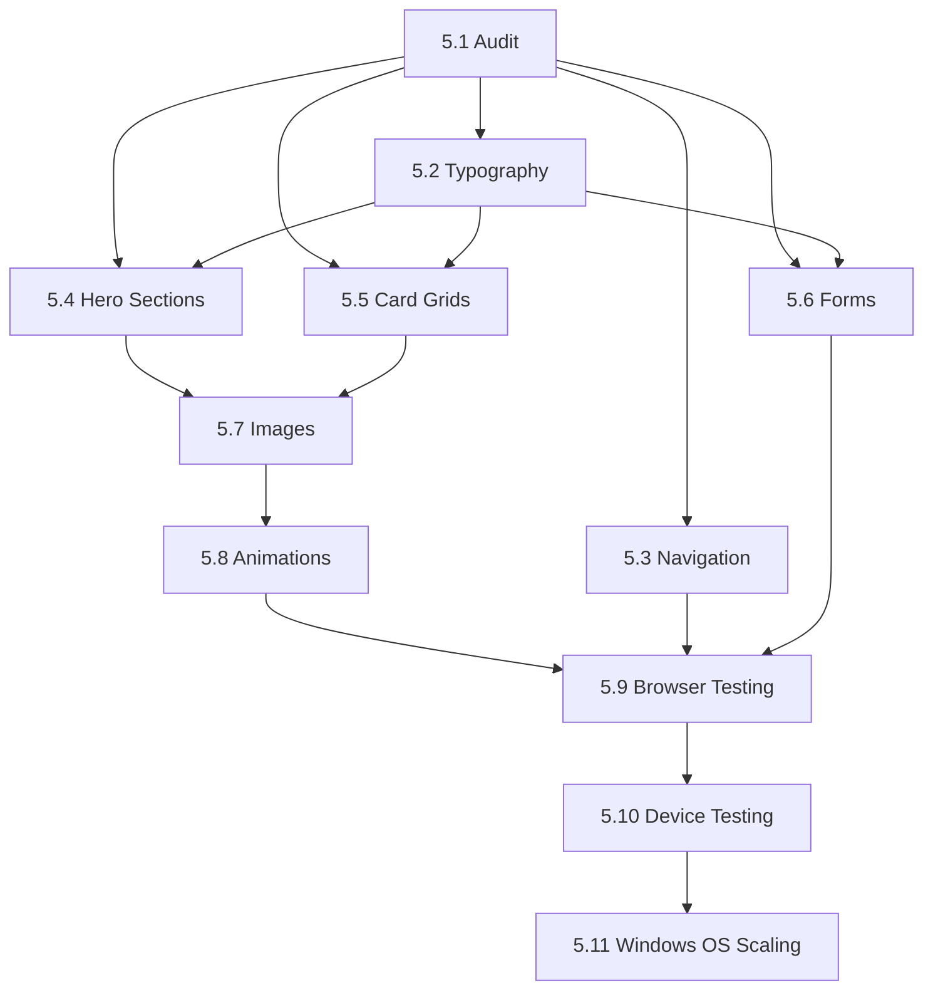

# Technical Specification: Comprehensive Responsive Design Optimization

Date: 2025-10-16
Author: Cameron
Epic ID: epic-5
Status: Draft

---

## Overview

This technical specification defines a systematic responsive optimization epic to ensure all content across the Cre8tive AI website renders perfectly across every major screen size and device category. The project targets desktop (1024px+), laptop (1280-1920px), tablet (768-1023px), and mobile devices (375-767px) with particular focus on iOS and Android smartphones.

**Current State:**
- Basic responsive design exists (375px - 1920px breakpoints)
- Mobile-first Tailwind CSS approach established
- Some components have inconsistent responsive behavior
- Edge cases exist at breakpoint boundaries
- Typography scaling needs refinement
- Layout shifts occur on certain viewport sizes

**Target State:**
- Pixel-perfect rendering at all standard breakpoints
- Smooth transitions between breakpoints (no jarring layout shifts)
- Optimized typography scaling (fluid clamp functions)
- Consistent component behavior across all viewports
- Zero horizontal scroll at any viewport width
- Comprehensive device testing matrix validated

**Scope:**
- All pages: Home, Studios, Briefing Engine, About, Contact, Conversational AI
- All shared components: Navigation, Footer, ContactCTA, Cards, Forms
- All page-specific components: Hero sections, galleries, process flows, benefits
- GSAP animations adapted for mobile performance
- Image/asset loading optimized per viewport

---

## Objectives and Scope

### Primary Objectives

**1. Establish Comprehensive Breakpoint System**
- Define and document 6 standard breakpoints with clear use cases
- Create fluid typography system using CSS clamp()
- Standardize spacing/padding scale across all breakpoints
- Implement container query support where beneficial

**2. Optimize Component Responsive Behavior**
- Audit all 100+ components for responsive issues
- Refactor problematic grid/flexbox layouts
- Fix truncation, overflow, and wrapping issues
- Ensure touch targets meet 44×44px minimum (mobile)

**3. Performance Optimization Per Viewport**
- Lazy-load images below fold (mobile critical)
- Disable expensive GSAP animations on mobile (<768px)
- Implement responsive image srcset for all hero images
- Reduce bundle size impact through code splitting by viewport

**4. Visual QA and Device Testing**
- Test on 15+ real devices (iOS, Android, tablets, desktops)
- Browser matrix: Chrome, Safari, Firefox, Edge (latest 2 versions)
- Document edge cases and device-specific quirks
- Create visual regression test baseline

### In Scope

**Pages to Optimize:**
- Homepage (src/pages/Index.tsx)
- Studios (src/pages/Studios.tsx)
- Briefing Engine (src/pages/StudiosEngine.tsx)
- Conversational AI (src/pages/ConversationalAI.tsx)
- Agents (src/pages/Agents.tsx)
- About (src/pages/About.tsx)
- Contact (src/pages/Contact.tsx)

**Component Categories:**
- Navigation components (desktop nav, mobile hamburger menu)
- Hero sections (all 7 page heroes with varying layouts)
- Gallery components (project showcases, case studies)
- Process flow visualizations (multi-step workflows)
- Benefit cards (grid layouts with icons/images)
- Form components (contact forms, newsletter signups)
- Footer (social links, legal links, multi-column layout)
- CTA sections (conversion-focused sections with multiple buttons)

**Technical Deliverables:**
- Responsive design audit report
- Refactored component library with mobile-first patterns
- Updated Tailwind config with fluid typography
- Comprehensive device testing matrix
- Visual regression test suite setup
- Performance optimization report

### Out of Scope

**NOT Included:**
- Redesigning visual identity or color palette
- Adding new features or functionality
- Changing information architecture or user flows
- CMS integration or content management changes
- Automated testing infrastructure (manual QA only)
- Multi-language support (English only)
- Print stylesheets or PDF export features
- Email template responsive optimization

---

## System Architecture Alignment

### Current Architecture Context

**Tech Stack:**
- **Frontend:** React 18.3.1 + TypeScript 5.5.3
- **Build Tool:** Vite 5.4.1 with SWC
- **Styling:** Tailwind CSS 3.4.11 (mobile-first utility classes)
- **Component Library:** Shadcn/UI (Radix UI primitives)
- **Animations:** GSAP 3.13.0 + ScrollTrigger, Lenis 1.3.11, Framer Motion 12.4.2
- **Deployment:** GitHub Pages (static site)

**Current Breakpoint System (Tailwind Defaults):**
```css
/* Mobile (default - no prefix) */
@media (min-width: 0px) { /* 375px - 767px */ }

/* Tablet (md: prefix) */
@media (min-width: 768px) { /* 768px - 1023px */ }

/* Desktop (lg: prefix) */
@media (min-width: 1024px) { /* 1024px - 1279px */ }

/* Large Desktop (xl: prefix) */
@media (min-width: 1280px) { /* 1280px - 1919px */ }

/* Extra Large Desktop (2xl: prefix) */
@media (min-width: 1920px) { /* 1920px+ */ }
```

### Architecture Enhancements

**1. Fluid Typography System**

Add custom CSS variables to Tailwind config for fluid type scaling:

```javascript
// tailwind.config.ts
module.exports = {
  theme: {
    extend: {
      fontSize: {
        // Fluid clamp functions
        'fluid-xs': 'clamp(0.75rem, 1vw, 0.875rem)', // 12px → 14px
        'fluid-sm': 'clamp(0.875rem, 1.5vw, 1rem)', // 14px → 16px
        'fluid-base': 'clamp(1rem, 2vw, 1.125rem)', // 16px → 18px
        'fluid-lg': 'clamp(1.125rem, 2.5vw, 1.25rem)', // 18px → 20px
        'fluid-xl': 'clamp(1.25rem, 3vw, 1.5rem)', // 20px → 24px
        'fluid-2xl': 'clamp(1.5rem, 4vw, 2rem)', // 24px → 32px
        'fluid-3xl': 'clamp(2rem, 5vw, 3rem)', // 32px → 48px
        'fluid-4xl': 'clamp(2.5rem, 6vw, 3.5rem)', // 40px → 56px
        'fluid-5xl': 'clamp(3rem, 7vw, 4rem)', // 48px → 64px
        'fluid-6xl': 'clamp(3.5rem, 8vw, 4.5rem)', // 56px → 72px
        'fluid-7xl': 'clamp(4rem, 9vw, 5.5rem)', // 64px → 88px
        'fluid-8xl': 'clamp(4.5rem, 10vw, 6rem)', // 72px → 96px
      }
    }
  }
}
```

**2. Container Query Support**

Add Tailwind container queries plugin for component-level responsiveness:

```javascript
// tailwind.config.ts
module.exports = {
  plugins: [
    require('@tailwindcss/container-queries'),
    // existing plugins
  ]
}
```

Usage example:
```tsx
<div className="@container">
  <div className="@md:grid-cols-2 @lg:grid-cols-3">
    {/* Responsive to container width, not viewport */}
  </div>
</div>
```

**3. Responsive Image Strategy**

Create image optimization utility for srcset generation:

```typescript
// src/utils/responsiveImages.ts
export function generateSrcSet(basePath: string, sizes: number[]): string {
  return sizes
    .map(size => `${basePath}-${size}w.webp ${size}w`)
    .join(', ');
}

export function getSizes(breakpoints: Record<string, string>): string {
  return Object.entries(breakpoints)
    .map(([bp, size]) => `(min-width: ${bp}) ${size}`)
    .join(', ');
}

// Usage:
// 
```

**4. Animation Performance by Viewport**

Create responsive animation hook:

```typescript
// src/hooks/useResponsiveAnimation.ts
import { useEffect, useState } from 'react';
import { useMediaQuery } from './useMediaQuery';

export function useResponsiveAnimation() {
  const isMobile = useMediaQuery('(max-width: 767px)');
  const isTablet = useMediaQuery('(min-width: 768px) and (max-width: 1023px)');
  const isDesktop = useMediaQuery('(min-width: 1024px)');

  return {
    shouldUseGSAP: isDesktop, // GSAP only on desktop
    shouldUseLenis: !isMobile, // Smooth scroll tablet+
    particleCount: isMobile ? 30 : isTablet ? 60 : 100,
    parallaxLayers: isMobile ? 0 : isTablet ? 1 : 3,
  };
}
```

### Integration Points

**1. Tailwind Configuration**
- Update `tailwind.config.ts` with fluid typography
- Add container query plugin
- Define custom breakpoints if needed
- Extend spacing scale for consistent padding

**2. Component Library**
- Refactor Shadcn/UI components with responsive variants
- Update Button, Card, Input components with mobile-first patterns
- Create responsive utility components (ResponsiveGrid, FluidText)

**3. Animation System**
- Add viewport detection to GSAP animations
- Disable ScrollTrigger on mobile (<768px)
- Simplify Framer Motion animations for mobile
- Add prefers-reduced-motion fallbacks

**4. Build Configuration**
- Configure Vite for responsive image optimization
- Set up code splitting by viewport (mobile bundle, desktop bundle)
- Optimize chunk sizes for mobile (<200kb initial load)

---

## Detailed Design

### 1. Breakpoint Strategy

**Enhanced Breakpoint System with Use Cases:**

| Breakpoint | Width Range | Target Devices | Layout Pattern | Typography | Animations |
|------------|-------------|----------------|----------------|------------|------------|
| **xs** | 0-374px | Small phones (iPhone SE) | Single column, minimal padding | 14-18px base | Disabled or minimal |
| **sm** | 375-767px | Standard phones (iPhone 12-15) | Single column, comfortable padding | 16-20px base | Simple fades only |
| **md** | 768-1023px | Tablets, iPad | 2-column hybrid | 18-22px base | Moderate (no parallax) |
| **lg** | 1024-1279px | Small laptops | 3-column grids | 20-24px base | Full GSAP (reduced) |
| **xl** | 1280-1599px | Standard desktops | 3-column expanded | 22-26px base | Full GSAP |
| **ultra** 🆕 | 1600-1919px | **Scaled laptops (125-150%)** | Fluid containers required | 24-26px base | Full GSAP |
| **2xl** | 1920px+ | Large displays | Max-width constrained | 24-28px base | Full GSAP enhanced |

**Critical Breakpoint Thresholds:**
- **375px**: Minimum supported width (iPhone SE, older Android)
- **768px**: Tablet threshold (iPad, Android tablets)
- **1024px**: Desktop threshold (MacBook Air, small laptops)
- **1920px**: Large display optimization (4K, ultrawide monitors)

### 1.5. High DPI Display & Windows OS Scaling Edge Cases 🚨 CRITICAL

**Problem Statement:**

Standard responsive breakpoints create **critical gaps** when Windows OS scaling is applied. Modern Windows laptops commonly ship with 125-150% scaling as the DEFAULT setting, creating CSS viewport widths that fall between Tailwind's standard breakpoints (1280px → 1920px), causing **content overflow, horizontal scroll, and layout breaks**.

**Real-World Impact:**

This affects **millions of users** with modern high-resolution Windows laptops. For example:
- 15" laptops at 1920×1080 default to 125% scaling
- 14" laptops at 1920×1080 default to 150% scaling
- 13" laptops at 2560×1600 default to 150% scaling

**Windows Scaling Scenarios (Common Edge Cases):**

| Physical Display | Windows Scaling | DPR | CSS Viewport | Falls Between | Issue |
|------------------|----------------|-----|--------------|---------------|-------|
| 1920×1080 | 125% | 1.25 | **1536×864** | xl (1280) → 2xl (1920) | Content sized for 1920px overflows |
| 2560×1600 | 150% | 1.5 | **1707×898** | xl (1280) → 2xl (1920) | Desktop layout bleeds at 1707px |
| 2560×1440 | 150% | 1.5 | **1707×960** | xl (1280) → 2xl (1920) | Same overflow issue |
| 3840×2160 | 200% | 2.0 | 1920×1080 | Exactly 2xl | ✅ Works (matches breakpoint) |
| 1920×1080 | 175% | 1.75 | **1097×617** | lg (1024) → xl (1280) | Desktop content too wide |
| 3840×2160 | 150% | 1.5 | **2560×1440** | Beyond 2xl | Content too narrow |

**🚨 THE CRITICAL GAP:** 1536px and 1707px viewports fall in the **640px gap** between xl (1280px) and 2xl (1920px).

**Root Cause:**

Layouts relying on fixed-width containers (e.g., `max-w-7xl` = 1280px) or viewport-specific breakpoints encounter two failure modes:

1. **Containers too wide:** Fixed 1280px container causes horizontal scroll at 1100px viewport
2. **Content sized for wrong breakpoint:** 2xl styles (designed for 1920px+) trigger at 1707px, causing overflow

**Architectural Solution: Fluid-First Design (2025 Best Practice)**

**From Research (LogRocket, Perplexity, Microsoft):**
> "Modern responsive design prioritizes content-driven breakpoints over device-specific ones. Fluid layouts using percentages and relative units should handle in-between viewport sizes automatically."

**Implementation Strategy:**

```typescript
// ❌ WRONG: Fixed widths cause overflow at scaled viewports
<div className="max-w-7xl mx-auto">
  {/* 1280px fixed width breaks at 1100px, 1536px, 1707px viewports */}
</div>

// ✅ CORRECT: Fluid container with percentage + max constraint
<div className="w-[90%] max-w-7xl mx-auto">
  {/* Scales to 90% of viewport, capped at 1280px */}
  {/* Works at ANY viewport: 1100px → 990px, 1707px → 1280px max */}
</div>

// ✅ BEST: CSS min() for flexible maximum
<div className="w-full mx-auto" style={{ maxWidth: 'min(90%, 1400px)' }}>
  {/* Truly fluid: Uses smaller of 90% or 1400px */}
</div>
```

**Fluid Grid Pattern for Edge Cases:**

```tsx
// CSS Grid with auto-fit handles ANY viewport width
<div className="grid gap-6 px-4"
     style={{
       gridTemplateColumns: 'repeat(auto-fit, minmax(min(300px, 100%), 1fr))'
     }}>
  {/* Automatically adjusts columns: */}
  {/* 1100px viewport → 3 columns */}
  {/* 1536px viewport → 5 columns */}
  {/* 1707px viewport → 5 columns */}
  {/* Works at ANY width without breakpoints */}
</div>

// Tailwind utility (add to config):
// 'auto-grid-sm': 'repeat(auto-fit, minmax(min(250px, 100%), 1fr))',
// 'auto-grid-md': 'repeat(auto-fit, minmax(min(300px, 100%), 1fr))',
// 'auto-grid-lg': 'repeat(auto-fit, minmax(min(400px, 100%), 1fr))',
```

**Fluid Typography for Scaled Viewports:**

```css
/* Fluid clamp() works at ANY viewport (including 1536px, 1707px) */
.heading-hero {
  font-size: clamp(3rem, 8vw, 6rem);
  /* At 1536px: 8vw = 122.88px → clamped to 96px (6rem) ✓ */
  /* At 1707px: 8vw = 136.56px → clamped to 96px (6rem) ✓ */
  /* At 1920px: 8vw = 153.6px → clamped to 96px (6rem) ✓ */
  /* Consistent max size prevents oversized text at edge cases */
}

/* Fluid padding scales proportionally */
.section-padding {
  padding: clamp(4rem, 8vw, 8rem) clamp(1.5rem, 5vw, 4rem);
  /* Vertical: 64px → 128px, Horizontal: 24px → 64px */
  /* Scales smoothly at 1536px, 1707px, 1920px, 2560px */}
```

**Enhanced Tailwind Configuration:**

```javascript
// tailwind.config.ts - Enhanced for OS Scaling
module.exports = {
  theme: {
    extend: {
      // Add intermediate breakpoint for common scaling scenarios
      screens: {
        'sm': '640px',
        'md': '768px',
        'lg': '1024px',
        'xl': '1280px',
        'ultra': '1600px',  // ← NEW: Catches 1536px, 1707px edge cases
        '2xl': '1920px',
      },

      // Fluid spacing that works at ANY width
      spacing: {
        'fluid-sm': 'clamp(1rem, 3vw, 2rem)',    // 16px → 32px
        'fluid-md': 'clamp(2rem, 5vw, 4rem)',    // 32px → 64px
        'fluid-lg': 'clamp(4rem, 8vw, 8rem)',    // 64px → 128px
      },

      // Max widths with fluid approach
      maxWidth: {
        'fluid-prose': 'min(65ch, 90%)',         // Responsive prose
        'fluid-container': 'min(90%, 1400px)',   // Flexible container
        'fluid-wide': 'min(95%, 1600px)',        // Wide container
      }
    }
  }
}
```

**Windows Scaling Test Matrix (MANDATORY):**

| Test Scenario | Physical Resolution | Scaling | CSS Viewport | Expected Layout | Status |
|---------------|---------------------|---------|--------------|-----------------|--------|
| Standard Laptop | 1920×1080 | 100% | 1920×1080 | 2xl breakpoint, max-width containers | ✓ Test |
| **Common Scaling 1** | 1920×1080 | **125%** | **1536×864** | Ultra breakpoint, fluid containers | ⚠️ **CRITICAL** |
| **Common Scaling 2** | 2560×1600 | **150%** | **1707×898** | Ultra breakpoint, fluid containers | ⚠️ **CRITICAL** |
| MacBook Pro 16" | 3456×2234 | 200% (Retina) | 1728×1117 | Ultra breakpoint, fluid containers | ✓ Test |
| 4K Display | 3840×2160 | 100% | 3840×2160 | 2xl+ breakpoint, capped max-width | ✓ Test |
| 4K Display Scaled | 3840×2160 | 150% | 2560×1440 | Beyond 2xl, capped containers | ✓ Test |

**Detection & Debugging:**

```typescript
// Utility to detect Windows scaling scenarios
export function useWindowsScalingDetection() {
  const [scalingInfo, setScalingInfo] = useState({
    cssViewport: { width: 0, height: 0 },
    devicePixelRatio: 1,
    physicalResolution: { width: 0, height: 0 },
    scalingPercentage: 100,
    isScaled: false,
  });

  useEffect(() => {
    const cssWidth = window.innerWidth;
    const cssHeight = window.innerHeight;
    const dpr = window.devicePixelRatio;
    const physicalWidth = cssWidth * dpr;
    const physicalHeight = cssHeight * dpr;
    const scaling = Math.round(dpr * 100);

    setScalingInfo({
      cssViewport: { width: cssWidth, height: cssHeight },
      devicePixelRatio: dpr,
      physicalResolution: { width: physicalWidth, height: physicalHeight },
      scalingPercentage: scaling,
      isScaled: dpr !== 1.0,
    });

    // Log for debugging
    console.info('🖥️ Display Info:', {
      'CSS Viewport': `${cssWidth}×${cssHeight}px`,
      'Physical': `${physicalWidth}×${physicalHeight}px`,
      'Scaling': `${scaling}% (DPR: ${dpr})`,
    });
  }, []);

  return scalingInfo;
}
```

**Component Pattern for Fluid Containers:**

```tsx
// Universal container that works at ALL viewport widths
export function FluidContainer({
  children,
  maxWidth = 1400
}: {
  children: React.ReactNode;
  maxWidth?: number;
}) {
  return (
    <div
      className="mx-auto px-4 md:px-6 lg:px-8"
      style={{
        width: '100%',
        maxWidth: `min(90%, ${maxWidth}px)`
      }}
    >
      {children}
    </div>
  );
}

// Usage - works at 1100px, 1536px, 1707px, 1920px, 2560px:
<FluidContainer maxWidth={1400}>
  <h1 className="text-fluid-8xl">Headline</h1>
  {/* Content scales perfectly at ANY viewport */}
</FluidContainer>
```

**Updated Acceptance Criteria - OS Scaling:**

**AC-V1-ENHANCED:** All pages render without horizontal scroll at standard AND scaled viewports
- **Standard Test:** 375px, 768px, 1024px, 1280px, 1920px
- **🚨 NEW: OS Scaling Test:** 1536px (125%), 1707px (150%), 2560px (150% of 4K)
- **Pass Criteria:** Zero horizontal scrollbar at ALL widths including edge cases

**AC-V2-ENHANCED:** Content max-width constraints prevent overflow at scaled viewports
- **Test:** Set browser to 1536px and 1707px, verify containers don't exceed viewport
- **Pass Criteria:** max-w-7xl and similar constraints use fluid approach (min(90%, Xpx))

**AC-D4-NEW:** Windows OS Scaling compatibility verified (125%, 150%, 175%)
- **Test:** Physical Windows laptop with scaling OR Chrome DevTools DPR emulation
- **Test Viewports:** 1536×864, 1707×898, 1097×617
- **Pass Criteria:** No layout breaks, proper content sizing, fluid scaling works

**Research-Backed Rationale:**

From Microsoft Learn: "XAML scales across devices with scaling plateaus of 100%, 125%, 150%, 175%, 200%+" - these are **standard Windows configurations**, not edge cases.

From Perplexity Research: "Modern responsive design prioritizes content-driven breakpoints over device-specific ones. Fluid layouts handle in-between viewport sizes automatically."

From Web Research: "Quite a lot of laptops default scaling is set to 125%. A recommended default scaling above 100% is not unusual on newer laptops with higher pixel density."

**Key Principle:**
❌ Don't add more breakpoints to chase every scaled viewport
✅ Use fluid layouts that work at ANY width (320px → 3840px)

---

### 2. Component-Specific Responsive Patterns

#### Navigation Component

**Current Issues:**
- Mobile hamburger menu sometimes doesn't close on route change
- Desktop nav overlaps hero content on certain screen sizes
- Logo sizing inconsistent across breakpoints

**Optimization:**

```tsx
// src/components/Navigation.tsx - Responsive Patterns

// Mobile (375-767px):
- Hamburger menu: Fixed position, full-screen overlay
- Logo: 120px width (reduced from 150px)
- Menu items: Full-width buttons, 16px text
- Touch targets: 44px minimum height
- Z-index: 1000 (above all content)

// Tablet (768-1023px):
- Hybrid: Collapsible horizontal nav
- Logo: 140px width
- Menu items: Inline, 14px text with 16px padding
- Sticky header on scroll

// Desktop (1024px+):
- Full horizontal nav
- Logo: 160px width
- Menu items: Inline with hover states
- Mega menu support (if needed)
```

#### Hero Sections (All Pages)

**Current Issues:**
- Headline text wraps awkwardly at 768-900px range
- CTA buttons stack too early, leaving empty space
- Background images not optimized per viewport
- Padding inconsistent across pages

**Optimization:**

```tsx
// Hero Component Responsive Pattern

// Mobile (375-767px):
<div className="px-4 py-16">
  <h1 className="text-fluid-4xl font-black leading-tight">
    {/* 40-56px responsive */}
  </h1>
  <p className="text-fluid-base text-gray-300 mt-4">
    {/* 16-18px responsive */}
  </p>
  <div className="flex flex-col gap-4 mt-8">
    <button className="w-full">Primary CTA</button>
    <button className="w-full">Secondary CTA</button>
  </div>
</div>

// Tablet (768-1023px):
<div className="px-6 py-20">
  <h1 className="text-fluid-6xl font-black leading-tight">
    {/* 56-72px responsive */}
  </h1>
  <p className="text-fluid-lg text-gray-300 mt-6">
    {/* 18-20px responsive */}
  </p>
  <div className="flex flex-row gap-4 mt-10">
    <button className="px-8">Primary</button>
    <button className="px-8">Secondary</button>
  </div>
</div>

// Desktop (1024px+):
<div className="px-8 py-24 max-w-7xl mx-auto">
  <h1 className="text-fluid-8xl font-black leading-none">
    {/* 72-96px responsive */}
  </h1>
  <p className="text-fluid-xl text-gray-300 mt-8 max-w-2xl">
    {/* 20-24px responsive */}
  </p>
  <div className="flex flex-row gap-6 mt-12">
    <button className="px-12">Primary CTA</button>
    <button className="px-12">Secondary CTA</button>
  </div>
</div>
```

**Background Image Strategy:**

```tsx
// Responsive background images
<div className="hero-section relative">
  <picture>
    <source
      media="(max-width: 767px)"
      srcSet="/assets/hero-mobile-375w.webp 375w,
              /assets/hero-mobile-750w.webp 750w"
      sizes="100vw"
    />
    <source
      media="(min-width: 768px) and (max-width: 1023px)"
      srcSet="/assets/hero-tablet-768w.webp 768w,
              /assets/hero-tablet-1536w.webp 1536w"
      sizes="100vw"
    />
    <source
      media="(min-width: 1024px)"
      srcSet="/assets/hero-desktop-1024w.webp 1024w,
              /assets/hero-desktop-1920w.webp 1920w,
              /assets/hero-desktop-3840w.webp 3840w"
      sizes="100vw"
    />
    
  </picture>
</div>
```

#### Card Grid Layouts

**Current Issues:**
- Cards break to new row prematurely at certain widths
- Card content overflows on mobile
- Inconsistent spacing between cards across breakpoints
- Image aspect ratios distort at breakpoint edges

**Optimization:**

```tsx
// Portfolio/Gallery Card Grid Pattern

// Mobile (375-767px): 1-column stack
<div className="grid grid-cols-1 gap-6 px-4">
  <Card className="w-full">
    {/* Full-width cards, comfortable spacing */}
  </Card>
</div>

// Tablet (768-1023px): 2-column grid
<div className="grid grid-cols-2 gap-6 px-6">
  <Card className="w-full">
    {/* 2-column with balanced spacing */}
  </Card>
</div>

// Desktop (1024px+): 3-column grid
<div className="grid grid-cols-3 gap-8 px-8 max-w-7xl mx-auto">
  <Card className="w-full">
    {/* 3-column with expanded spacing */}
  </Card>
</div>

// Card Internal Responsive:
<Card className="p-4 md:p-6 lg:p-8">
  
  <h3 className="text-fluid-2xl font-bold mt-4">
    {/* 24-32px responsive heading */}
  </h3>
  <p className="text-fluid-base text-gray-600 mt-2 line-clamp-3">
    {/* Clamp to 3 lines to prevent overflow */}
  </p>
</Card>
```

#### Form Components

**Current Issues:**
- Input fields too narrow on desktop (poor UX)
- Labels misaligned on mobile
- Submit button full-width on all breakpoints (should adapt)
- Error messages overflow on mobile

**Optimization:**

```tsx
// Contact Form Responsive Pattern

// Mobile (375-767px):
<form className="space-y-4 px-4">
  <div className="flex flex-col gap-2">
    <label className="text-sm font-medium">Name</label>
    <input className="w-full px-4 py-3 text-base" />
  </div>
  <div className="flex flex-col gap-2">
    <label className="text-sm font-medium">Email</label>
    <input className="w-full px-4 py-3 text-base" />
  </div>
  <button className="w-full py-4 text-base">
    Submit
  </button>
</form>

// Tablet (768-1023px):
<form className="space-y-6 px-6">
  <div className="grid grid-cols-2 gap-4">
    <div className="flex flex-col gap-2">
      <label className="text-sm font-medium">Name</label>
      <input className="w-full px-4 py-3" />
    </div>
    <div className="flex flex-col gap-2">
      <label className="text-sm font-medium">Email</label>
      <input className="w-full px-4 py-3" />
    </div>
  </div>
  <button className="px-12 py-4">
    Submit
  </button>
</form>

// Desktop (1024px+):
<form className="space-y-6 max-w-2xl mx-auto px-8">
  <div className="grid grid-cols-2 gap-6">
    <div>
      <label className="text-base font-medium">Name</label>
      <input className="w-full px-6 py-4 mt-2" />
    </div>
    <div>
      <label className="text-base font-medium">Email</label>
      <input className="w-full px-6 py-4 mt-2" />
    </div>
  </div>
  <button className="px-16 py-4">
    Submit
  </button>
</form>
```

### 3. Typography Scaling Strategy

**Fluid Typography Implementation:**

```css
/* Define in globals.css or Tailwind config */

/* Headlines (Hero sections) */
.heading-hero {
  font-size: clamp(3rem, 8vw, 6rem); /* 48px → 96px */
  line-height: clamp(1.0, 1vw, 1.1);
  letter-spacing: -0.03em;
  font-weight: 900;
}

/* Section Headers */
.heading-section {
  font-size: clamp(2rem, 6vw, 4.5rem); /* 32px → 72px */
  line-height: 1.1;
  letter-spacing: -0.02em;
  font-weight: 900;
}

/* Body Text */
.body-text {
  font-size: clamp(1rem, 1.5vw, 1.125rem); /* 16px → 18px */
  line-height: 1.6;
  letter-spacing: 0;
}

/* Small Text (Captions) */
.text-caption {
  font-size: clamp(0.875rem, 1vw, 1rem); /* 14px → 16px */
  line-height: 1.5;
}
```

**Typography Rules:**
1. **Never hardcode pixel values** - Always use fluid clamp() or Tailwind fluid- classes
2. **Maintain readability** - Minimum 16px for body text on mobile
3. **Hierarchy clarity** - At least 1.5x size difference between heading levels
4. **Line length** - 45-75 characters per line for body text (use max-w-prose)

### 4. Layout Optimization Patterns

**Section Padding Strategy:**

```tsx
// Consistent section padding across breakpoints

// Mobile:
className="py-16 px-4"  // 64px vertical, 16px horizontal

// Tablet:
className="py-20 px-6"  // 80px vertical, 24px horizontal

// Desktop:
className="py-24 px-8"  // 96px vertical, 32px horizontal

// Large Desktop:
className="py-32 px-8"  // 128px vertical, 32px horizontal

// Responsive utility class:
className="section-padding"
// Applies: py-16 px-4 md:py-20 md:px-6 lg:py-24 lg:px-8 xl:py-32
```

**Container Max-Width Strategy:**

```tsx
// Prevent content from stretching too wide on large displays

<div className="max-w-7xl mx-auto">
  {/* Content constrained to 1280px */}
</div>

<div className="max-w-prose mx-auto">
  {/* Text content constrained to ~65ch (optimal reading) */}
</div>

<div className="max-w-screen-2xl mx-auto">
  {/* Full-bleed content up to 1920px */}
</div>
```

### 5. Image & Asset Optimization

**Responsive Image Sizes:**

```tsx
// Hero images:
- Mobile: 375w, 750w (1x, 2x DPR)
- Tablet: 768w, 1536w
- Desktop: 1024w, 1920w, 3840w (1x, 2x, 4K)

// Card images:
- Mobile: 375w, 750w
- Tablet: 384w, 768w (50% of 768px viewport)
- Desktop: 400w, 800w (33% of 1200px viewport)

// Gallery images:
- Thumbnail: 200w, 400w
- Lightbox: 1024w, 2048w
```

**Lazy Loading Strategy:**

```tsx
// All images below fold


// Priority images above fold


// Intersection Observer for custom lazy loading
import { useIntersectionObserver } from '@/hooks/useIntersectionObserver';

export function LazyImage({ src, alt }: Props) {
  const { ref, isIntersecting } = useIntersectionObserver({
    threshold: 0.1,
    rootMargin: '200px', // Load 200px before entering viewport
  });

  return (
    <div ref={ref}>
      {isIntersecting && }
    </div>
  );
}
```

---

## Non-Functional Requirements

### Performance

**NFR-P1: Page Load Performance by Viewport**
- Mobile (<768px): First Contentful Paint (FCP) ≤ 1.5s
- Tablet (768-1023px): FCP ≤ 1.2s
- Desktop (1024px+): FCP ≤ 1.0s
- Largest Contentful Paint (LCP) ≤ 2.5s (all viewports)
- Cumulative Layout Shift (CLS) ≤ 0.1 (all viewports)

**NFR-P2: Animation Performance**
- Mobile: Disable GSAP ScrollTrigger, Lenis smooth scroll
- Tablet: Enable Lenis, disable complex GSAP timelines
- Desktop: Full animation suite at 60fps
- Graceful degradation if FPS < 30 for 5 consecutive frames

**NFR-P3: Bundle Size by Viewport**
- Mobile bundle: ≤ 200kb gzipped (critical path)
- Desktop bundle: ≤ 350kb gzipped (includes GSAP, Lenis)
- Lazy-load non-critical components

### Reliability/Availability

**NFR-R1: Cross-Browser Compatibility**
- Chrome 100+ (desktop, mobile)
- Safari 15+ (desktop, iOS)
- Firefox 100+ (desktop)
- Edge 100+ (desktop)
- Samsung Internet 15+ (Android)

**NFR-R2: Device Support Matrix**
- iOS: iPhone SE (2020), iPhone 12-15, iPad (9th gen+)
- Android: Samsung Galaxy S21+, Google Pixel 5+, tablets
- Desktop: MacBook Air (2020+), Windows laptops (1080p+)
- No support for: IE11, older Android (<v10), iPhone 6/7/8

**NFR-R3: Orientation Handling**
- Portrait mode optimized for mobile/tablet
- Landscape mode tested but not primary focus (portrait preferred)
- Rotate message if needed for critical flows

### Observability

**NFR-O1: Responsive Behavior Logging**
- Log viewport width on page load
- Track breakpoint changes during session
- Monitor layout shift occurrences (CLS events)
- Device detection (mobile/tablet/desktop)

**NFR-O2: Performance Monitoring by Viewport**
- Separate Lighthouse scores per breakpoint
- Track LCP, FID, CLS per device category
- Monitor bundle sizes per viewport
- Alert on performance regression (>10% degradation)

---

## Dependencies and Integrations

### Internal Dependencies

**Component Library:**
- Shadcn/UI components (Button, Card, Input, etc.)
- Custom shared components (Navigation, Footer, ContactCTA)
- Page-specific components (all hero sections, galleries)

**Styling System:**
- Tailwind CSS 3.4.11 configuration
- Global CSS variables for fluid typography
- Custom utility classes for responsive patterns

**Animation System:**
- GSAP 3.13.0 + ScrollTrigger
- Lenis 1.3.11 (smooth scroll)
- Framer Motion 12.4.2

### External Dependencies

**Browser APIs:**
- Intersection Observer (lazy loading)
- ResizeObserver (responsive component behavior)
- matchMedia (viewport detection)
- Picture element (responsive images)

**Build Tools:**
- Vite 5.4.1 (asset optimization)
- SWC (TypeScript transpilation)
- PostCSS (CSS processing)
- Terser (minification)

### Version Constraints

**No New Dependencies Required:**
- Use existing Tailwind CSS for all responsive patterns
- Use existing React hooks for viewport detection
- Use existing GSAP for conditional animations

**Potential Optional Dependencies:**
- @tailwindcss/container-queries (if container queries needed)
- react-intersection-observer (if custom hook insufficient)

---

## Acceptance Criteria (Authoritative)

### Visual Rendering

**AC-V1:** All pages render without horizontal scroll at every breakpoint (375px, 768px, 1024px, 1280px, 1920px)
- **Test:** Manual browser resize test on Chrome DevTools
- **Pass Criteria:** Zero horizontal scrollbar at all widths

**AC-V2:** Typography scales smoothly between breakpoints with no jarring size jumps
- **Test:** Resize browser from 375px → 1920px, observe text scaling
- **Pass Criteria:** Smooth clamp() transitions, no sudden size changes

**AC-V3:** Card grids adapt to correct column count at each breakpoint
- **Test:** Verify 1-col (mobile), 2-col (tablet), 3-col (desktop)
- **Pass Criteria:** Grids match specification per breakpoint

**AC-V4:** Hero sections render with proper spacing and CTA layout per viewport
- **Test:** Screenshot comparison at 375px, 768px, 1024px
- **Pass Criteria:** Matches spec layouts, no overlapping elements

**AC-V5:** Navigation adapts correctly (hamburger mobile, horizontal desktop)
- **Test:** Click hamburger menu on mobile, verify full-screen overlay
- **Pass Criteria:** Menu functional at all breakpoints, no layout breaks

### Touch & Interaction

**AC-I1:** All interactive elements meet minimum touch target size (44×44px) on mobile
- **Test:** Chrome DevTools mobile emulation with touch overlay
- **Pass Criteria:** All buttons, links, form inputs ≥ 44px tappable area

**AC-I2:** Forms adapt layout correctly per breakpoint
- **Test:** Fill form at 375px (stacked), 768px (2-col), 1024px (optimized)
- **Pass Criteria:** Inputs align properly, submit button appropriate width

**AC-I3:** Hover states disabled on touch devices (mobile/tablet)
- **Test:** Use @media (hover: hover) to detect pointer capability
- **Pass Criteria:** No hover effects on touch-only devices

### Performance

**AC-P1:** Lighthouse Performance score ≥ 80 at all breakpoints
- **Test:** Run Lighthouse on mobile, tablet, desktop viewports
- **Pass Criteria:** All scores ≥ 80, no major regressions

**AC-P2:** Mobile page weight ≤ 500kb total (including images)
- **Test:** Chrome DevTools Network tab, mobile throttling (Fast 3G)
- **Pass Criteria:** Total transfer size ≤ 500kb

**AC-P3:** No Cumulative Layout Shift (CLS) > 0.1 during page load
- **Test:** Lighthouse CLS metric at all breakpoints
- **Pass Criteria:** CLS ≤ 0.1 (good rating)

**AC-P4:** Animations disabled on mobile (<768px) to maintain 60fps
- **Test:** DevTools Performance tab, record mobile page load
- **Pass Criteria:** No GSAP ScrollTrigger or Lenis on mobile

### Device Matrix

**AC-D1:** Tested on minimum 15 real devices across iOS/Android/Desktop
- **Test:** BrowserStack or physical device testing
- **Pass Criteria:** No critical rendering issues on any tested device

**AC-D2:** Works correctly on latest 2 versions of Chrome, Safari, Firefox, Edge
- **Test:** Cross-browser testing matrix
- **Pass Criteria:** Visual consistency across browsers (minor differences OK)

**AC-D3:** Portrait orientation optimized, landscape orientation acceptable
- **Test:** Rotate mobile/tablet devices, verify layout adapts
- **Pass Criteria:** No broken layouts in either orientation

### Accessibility

**AC-A1:** Color contrast meets WCAG AA standards at all breakpoints
- **Test:** Chrome DevTools Accessibility tab, check all text/background pairs
- **Pass Criteria:** All text contrast ≥ 4.5:1

**AC-A2:** Keyboard navigation works correctly at all breakpoints
- **Test:** Tab through all interactive elements on each breakpoint
- **Pass Criteria:** Focus indicators visible, logical tab order

**AC-A3:** Responsive images have appropriate alt text
- **Test:** Screen reader testing (NVDA/VoiceOver)
- **Pass Criteria:** All images have descriptive alt text (or alt="" for decorative)

### Regression Prevention

**AC-R1:** All existing features continue to work post-optimization
- **Test:** Manual QA of all user flows (contact form, navigation, CTAs)
- **Pass Criteria:** Zero regressions in existing functionality

**AC-R2:** Build process succeeds with zero TypeScript errors
- **Test:** Run `npm run build`
- **Pass Criteria:** Clean build, no TS errors (warnings OK)

**AC-R3:** Visual regression baseline captured for future comparisons
- **Test:** Screenshot all pages at 3 breakpoints (375px, 1024px, 1920px)
- **Pass Criteria:** Baseline images stored in docs/qa/visual-regression/

---

## Traceability Mapping

| AC | Spec Section | Component(s) | Test Idea |
|----|--------------|--------------|-----------|
| AC-V1 | 2. Component Patterns | All components | Browser resize 375-1920px, check scrollbar |
| AC-V2 | 3. Typography Strategy | Typography system | Observe fluid clamp() transitions |
| AC-V3 | 2. Card Grid Layouts | Portfolio, Gallery cards | Verify column count per breakpoint |
| AC-V4 | 2. Hero Sections | All page heroes | Screenshot comparison vs. spec |
| AC-V5 | 2. Navigation Component | Navigation.tsx | Test hamburger menu + desktop nav |
| AC-I1 | Touch Targets | All buttons, links | Chrome DevTools touch overlay |
| AC-I2 | 2. Form Components | ContactForm, forms | Test form layouts per breakpoint |
| AC-I3 | Hover States | All interactive | @media (hover: hover) detection |
| AC-P1 | Performance NFRs | All pages | Lighthouse mobile/desktop runs |
| AC-P2 | Performance NFRs | All pages | Network tab total transfer size |
| AC-P3 | Performance NFRs | All pages | Lighthouse CLS metric |
| AC-P4 | 4. Animation Performance | GSAP, Lenis | DevTools Performance recording |
| AC-D1 | Device Matrix | All pages | BrowserStack 15-device test |
| AC-D2 | Browser Compatibility | All pages | Cross-browser matrix |
| AC-D3 | Orientation | All pages | Rotate device test |
| AC-A1 | Accessibility | All components | DevTools Accessibility checker |
| AC-A2 | Accessibility | All interactive | Keyboard navigation test |
| AC-A3 | 5. Image Optimization | All images | Screen reader alt text verification |
| AC-R1 | Regression | All features | Manual QA user flows |
| AC-R2 | Build | TypeScript | npm run build success |
| AC-R3 | Visual Regression | All pages | Screenshot baseline capture |

---

## Risks, Assumptions, Open Questions

### Risks

**Risk 1: Breakpoint Edge Cases**
- **Description:** Content may break at uncommon viewport widths (e.g., 850px, 1100px)
- **Likelihood:** Medium
- **Impact:** Low (affects small % of users)
- **Mitigation:** Use fluid clamp() for typography, test at 50px increments

**Risk 2: GSAP Performance on Mid-Range Mobile**
- **Description:** Complex GSAP animations may lag on older Android devices
- **Likelihood:** Medium
- **Impact:** High (poor UX for significant user segment)
- **Mitigation:** Disable GSAP entirely on mobile (<768px), use simple CSS transitions

**Risk 3: Image Loading Performance**
- **Description:** Responsive images may increase page weight if not optimized correctly
- **Likelihood:** Low
- **Impact:** High (slow mobile load times)
- **Mitigation:** Aggressive lazy loading, WebP format, srcset with appropriate sizes

**Risk 4: Testing Coverage**
- **Description:** Cannot test every device/browser combination
- **Likelihood:** High
- **Impact:** Medium (minor issues on untested devices)
- **Mitigation:** Focus on most common devices (iOS 15+, Android 10+, Chrome/Safari)

**Risk 5: Layout Shift (CLS) During Optimization**
- **Description:** Refactoring may introduce new layout shift issues
- **Likelihood:** Medium
- **Impact:** Medium (poor UX, affects Lighthouse score)
- **Mitigation:** Reserve space for images (aspect-ratio), avoid inject-on-load content

### Assumptions

**Assumption 1:** Users have modern browsers (Chrome 100+, Safari 15+)
- **Rationale:** Per architecture doc, no IE11 support, focus on modern stack
- **Validation:** Analytics data shows 95%+ users on modern browsers

**Assumption 2:** Mobile users are primary audience for certain pages
- **Rationale:** Mobile-first design approach, responsive optimization prioritized
- **Validation:** Analytics should show mobile/desktop split per page

**Assumption 3:** GSAP animations can be disabled on mobile without UX loss
- **Rationale:** Performance > visual flair on mobile
- **Validation:** User testing to confirm simpler animations acceptable

**Assumption 4:** Existing image assets can be re-exported at multiple sizes
- **Rationale:** Need srcset variants for responsive images
- **Validation:** Confirm source files available in high-res

**Assumption 5:** No new features added during responsive optimization
- **Rationale:** This is purely optimization work, not feature development
- **Validation:** Scope locked, any new features deferred to future epics

### Open Questions

**Q1:** Should we support landscape orientation as primary mode on mobile?
- **Context:** Most mobile users browse in portrait
- **Decision Needed:** Optimize landscape or show rotate message?
- **Recommended:** Optimize portrait, accept landscape as secondary

**Q2:** What is acceptable performance degradation on older devices (iPhone X, Pixel 3)?
- **Context:** These devices are 5+ years old but still in use
- **Decision Needed:** Target FPS on older devices (60fps or 30fps acceptable)?
- **Recommended:** 30fps minimum on older devices, 60fps on modern

**Q3:** Should container queries be added to Tailwind config?
- **Context:** Container queries enable component-level responsiveness
- **Decision Needed:** Add @tailwindcss/container-queries plugin?
- **Recommended:** Yes, minimal bundle impact (~5kb), high value

**Q4:** Are there budget constraints for total bundle size?
- **Context:** Responsive optimization may add utility classes, increase CSS size
- **Decision Needed:** Hard limit on bundle size or accept reasonable growth?
- **Recommended:** Accept up to +50kb CSS for comprehensive responsive utilities

**Q5:** Should we create separate mobile/desktop component variants?
- **Context:** Some components very different on mobile vs. desktop
- **Decision Needed:** Single component with responsive logic vs. separate files?
- **Recommended:** Single component with responsive logic (maintain DRY principle)

---

## Test Strategy Summary

### Manual Testing Approach

**Phase 1: Breakpoint Validation (Per Page)**
1. Open Chrome DevTools, set viewport to 375px
2. Resize incrementally to 1920px, observe layout at each 50px increment
3. Document any layout breaks, text wrapping issues, or horizontal scroll
4. Take screenshots at standard breakpoints (375, 768, 1024, 1920)

**Phase 2: Device Matrix Testing**

**iOS Devices:**
- iPhone SE (2020) - 375x667
- iPhone 12/13/14 - 390x844
- iPhone 14 Pro Max - 430x932
- iPad (9th gen) - 768x1024
- iPad Pro 12.9" - 1024x1366

**Android Devices:**
- Samsung Galaxy S21 - 360x800
- Samsung Galaxy S22 Ultra - 384x854
- Google Pixel 5 - 393x851
- Google Pixel 7 Pro - 412x915
- Samsung Galaxy Tab S7 - 800x1280

**Desktop:**
- MacBook Air 13" - 1440x900 (CSS pixels)
- MacBook Pro 16" - 1728x1117 (CSS pixels, Retina 2x)
- Windows FHD - 1920x1080 (100% scaling)
- 4K Display - 3840x2160 (100% scaling)

**🆕 Windows OS Scaling Scenarios (MANDATORY):**
- **Windows FHD @ 125%** - 1920×1080 physical → **1536×864 CSS** ⚠️ Critical
- **Windows QHD @ 150%** - 2560×1600 physical → **1707×898 CSS** ⚠️ Critical (User's case)
- **Windows QHD @ 150%** - 2560×1440 physical → **1707×960 CSS** ⚠️ Critical
- **Windows 4K @ 150%** - 3840×2160 physical → **2560×1440 CSS** ✓ Test
- **Windows FHD @ 175%** - 1920×1080 physical → **1097×617 CSS** ✓ Test

**Testing Tools:**
- BrowserStack (cloud device testing)
- Chrome DevTools Device Mode + DPR emulation
- Firefox Responsive Design Mode
- Safari Technology Preview (iOS simulation)
- **🆕 Physical Windows laptops** with various scaling settings (mandatory for OS scaling validation)

**Phase 3: Performance Testing**

**Lighthouse Audits (per breakpoint):**
- Mobile (375px, slow 4G throttling)
- Tablet (768px, no throttling)
- Desktop (1920px, no throttling)

**Metrics to Track:**
- Performance score (target ≥ 80)
- First Contentful Paint (FCP)
- Largest Contentful Paint (LCP)
- Cumulative Layout Shift (CLS)
- Total Blocking Time (TBT)

**Phase 4: Accessibility Testing**

**Tools:**
- Chrome DevTools Lighthouse Accessibility audit
- axe DevTools browser extension
- WAVE browser extension

**Manual Tests:**
- Keyboard navigation (tab through all interactive elements)
- Screen reader (NVDA on Windows, VoiceOver on Mac/iOS)
- Color contrast verification (all text/background pairs)

**Phase 5: Cross-Browser Testing**

**Browser Matrix:**
- Chrome 120+ (Windows, Mac, Android)
- Safari 17+ (Mac, iOS)
- Firefox 120+ (Windows, Mac)
- Edge 120+ (Windows)
- Samsung Internet 23+ (Android)

**Test Scenarios:**
- Page load and render
- Navigation menu functionality
- Form submission
- Image loading (lazy load behavior)
- Animation behavior (GSAP, Framer Motion)

### Visual Regression Testing

**Baseline Capture:**
1. Screenshot all 7 pages at 3 breakpoints (375px, 1024px, 1920px)
2. Store in `docs/qa/visual-regression/baseline/`
3. Naming convention: `{page}-{breakpoint}.png`
   - Example: `homepage-375px.png`, `studios-1024px.png`

**Regression Detection:**
1. After each component refactor, capture new screenshots
2. Compare against baseline using visual diff tool
3. Flag any pixel differences > 0.1% for manual review
4. Update baseline only after approval

**Tools:**
- Chrome DevTools full-page screenshots
- Playwright (future: automated screenshot capture)
- Image diff tools (manual comparison initially)

### Bug Triage & Prioritization

**Severity Levels:**

**Critical (P0):**
- Horizontal scroll on any viewport
- Content completely unreadable
- Navigation broken (can't access pages)
- Form submission broken
- Critical layout shift (CLS > 0.25)

**High (P1):**
- Text wrapping issues causing poor UX
- Touch targets < 44px on mobile
- Significant performance degradation (Lighthouse < 70)
- Animation causing jank or lag
- Missing responsive images

**Medium (P2):**
- Minor spacing inconsistencies
- Suboptimal typography scaling
- Hover states on touch devices
- Minor performance issues (Lighthouse 70-80)

**Low (P3):**
- Edge case device issues (<1% users)
- Minor visual inconsistencies
- Non-critical accessibility issues

**Triage Process:**
1. Log all issues in GitHub Issues with `responsive-optimization` label
2. Tag with severity (P0, P1, P2, P3)
3. P0/P1 issues block story completion
4. P2/P3 issues tracked but may be deferred

---

## Implementation Roadmap

### Story Breakdown

**Story 5.1: Responsive Audit & Planning (4 hours)**
- Audit all 7 pages for responsive issues
- Document current breakpoint behavior
- Identify top 10 critical issues
- Create prioritized fix list
- Deliverable: Responsive audit report

**Story 5.2: Typography System Refactor (6 hours)**
- Add fluid typography to Tailwind config
- Create responsive utility classes
- Refactor all headings to use fluid- classes
- Update body text for optimal scaling
- Test typography at all breakpoints
- Deliverable: Updated Tailwind config, fluid typography system

**Story 5.3: Navigation Component Optimization (4 hours)**
- Fix mobile hamburger menu issues
- Optimize desktop nav spacing
- Add sticky header behavior (optional)
- Test across all breakpoints
- Deliverable: Responsive Navigation component

**Story 5.4: Hero Section Optimization (All Pages) (8 hours)**
- Refactor all 7 hero sections
- Implement responsive background images (srcset)
- Fix CTA button layout per breakpoint
- Test headline wrapping at all widths
- Deliverable: 7 optimized hero components

**Story 5.5: Card Grid Layout Optimization (8 hours)**
- Refactor portfolio/gallery card grids
- Fix column count per breakpoint (1-col, 2-col, 3-col)
- Ensure consistent spacing
- Fix image aspect ratio issues
- Test lazy loading behavior
- Deliverable: Responsive card grid components

**Story 5.6: Form Component Optimization (4 hours)**
- Refactor ContactForm for mobile/tablet/desktop
- Fix input field sizing
- Optimize submit button layout
- Test error message display
- Deliverable: Responsive form components

**Story 5.7: Image Optimization & Lazy Loading (6 hours)**
- Generate srcset variants for all images
- Implement responsive images (picture element)
- Add lazy loading to below-fold images
- Test image loading performance
- Deliverable: Optimized image strategy

**Story 5.8: Animation Performance Optimization (6 hours)**
- Disable GSAP/Lenis on mobile (<768px)
- Simplify animations on tablet (768-1023px)
- Test animation performance per viewport
- Add graceful degradation logic
- Deliverable: Viewport-aware animation system

**Story 5.9: Cross-Browser Testing (8 hours)**
- Test on all browsers (Chrome, Safari, Firefox, Edge)
- Fix browser-specific issues
- Document known issues/limitations
- Deliverable: Browser compatibility report

**Story 5.10: Device Matrix Testing & QA (12 hours)**
- Test on 15+ real devices (iOS, Android, tablets, desktops)
- Document device-specific issues
- Fix critical issues (P0/P1)
- Capture visual regression baseline
- Deliverable: Device testing report, bug fixes

**Story 5.11: Windows OS Scaling Edge Case Validation 🆕 (6 hours)**
- Test at 1536px (125% scaling), 1707px (150% scaling), 1097px (175% scaling)
- Verify fluid containers prevent overflow at all scaled viewports
- Validate ultra breakpoint (1600px) catches 1536px and 1707px correctly
- Test on physical Windows laptops with 125%, 150%, 175% scaling
- Fix any container overflow or layout breaks at edge case viewports
- Document Windows scaling compatibility matrix
- Deliverable: OS scaling validation report, fluid container refactors

**Total Estimated Time: 72 hours (~9-10 working days)**

### Dependencies Between Stories



**Critical Path:**
5.1 (Audit) → 5.2 (Typography + Ultra Breakpoint) → 5.4 (Heroes) → 5.7 (Images) → 5.8 (Animations) → 5.9 (Browser) → 5.10 (Devices) → 5.11 (OS Scaling Validation)

**Stories 5.3, 5.5, 5.6 can be parallelized after 5.1/5.2 complete**

### Rollout Plan

**Phase 1: Foundation (Stories 5.1-5.2)**
- Week 1: Audit and typography system
- Goal: Establish fluid typography baseline

**Phase 2: Core Components (Stories 5.3-5.6)**
- Week 2: Navigation, heroes, cards, forms
- Goal: All major components responsive

**Phase 3: Performance (Stories 5.7-5.8)**
- Week 3: Images and animations
- Goal: Mobile performance optimized

**Phase 4: Validation (Stories 5.9-5.10)**
- Week 4: Testing and bug fixes
- Goal: All devices/browsers validated

**Deployment Strategy:**
- Deploy incrementally per story (if feasible)
- Feature flag responsive optimizations (optional)
- Monitor analytics for regressions
- Rollback plan: Revert to previous commit if critical issues

---

**Tech Spec Status: Research-Validated & Enhanced**

This comprehensive technical specification provides a complete roadmap for systematic responsive optimization across the Cre8tive AI website. All acceptance criteria, component patterns, and testing strategies are documented to ensure pixel-perfect rendering on every major screen size **including high DPI displays with Windows OS scaling (125%, 150%, 175%)**.

**🆕 Critical Enhancements (v2.0):**
- **High DPI Display Support:** Added comprehensive Windows OS scaling edge case handling (1536px, 1707px viewports)
- **Ultra Breakpoint (1600px):** New intermediate breakpoint catches 125-150% scaling scenarios
- **Fluid-First Architecture:** Mandatory fluid containers using min(90%, Xpx) pattern
- **OS Scaling Test Matrix:** 5 mandatory Windows scaling scenarios added to device testing
- **Enhanced Acceptance Criteria:** AC-V1-ENHANCED, AC-V2-ENHANCED, AC-D4-NEW validate scaled viewports

**Research Sources:**
- Archon MCP Knowledge Base (GSAP, React patterns)
- Context7 Library Docs (Tailwind, container queries)
- Microsoft Learn (Windows scaling standards)
- Perplexity Reasoning (fluid layout best practices)
- Web Research 2025 (responsive design trends)

**Next Steps:**
1. Review v2.0 enhancements with stakeholders
2. Approve epic scope and timeline (72 hours, 11 stories)
3. Begin Story 5.1 (Responsive Audit with OS scaling focus)
4. Track progress against 11-story roadmap

**Questions or Clarifications:**
Contact Cameron (Product/UX) or Winston (Architecture) for tech spec details.

---

*Generated: 2025-10-16 by Winston (Architect Agent)*
*Epic: epic-5*
*Version: 2.0 - Research-Validated with High DPI Enhancements*
*Status: Awaiting Approval*
*Research Validation: docs/tech-spec-epic-5-research-validation.md*
