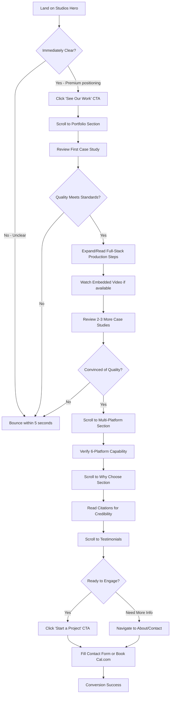
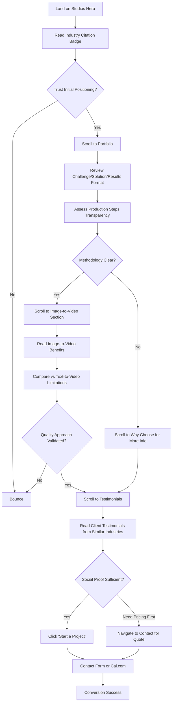
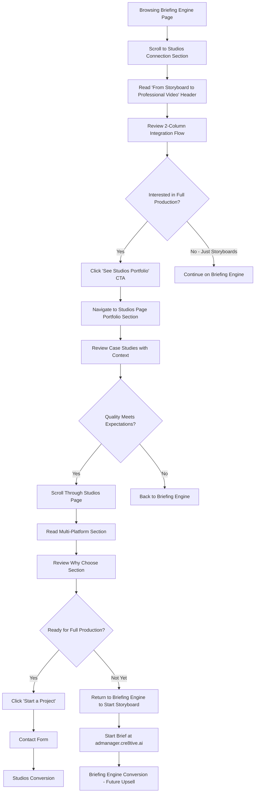
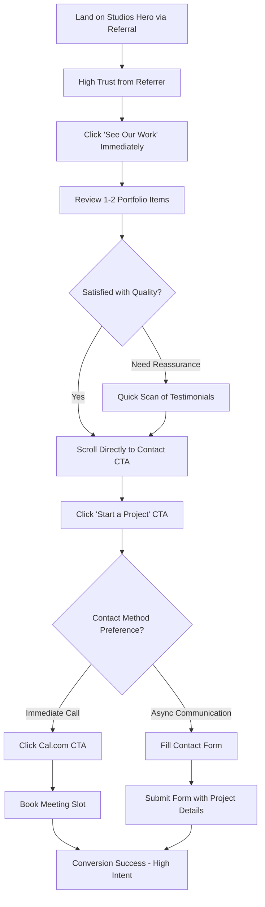
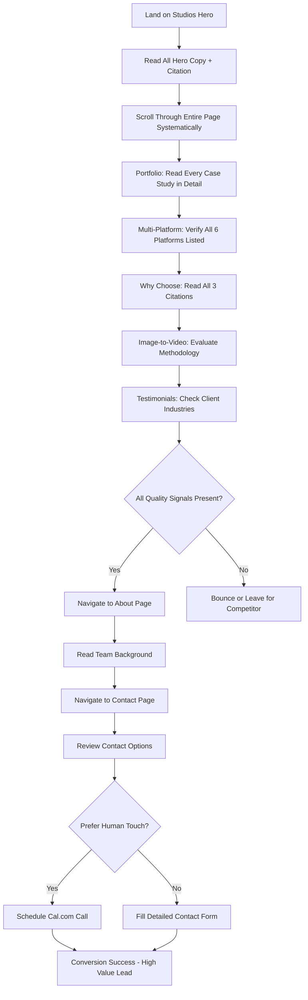

# Cre8tive AI Studios - UX/UI Specification

_Generated on 2025-10-10 by Cameron_

## Executive Summary

### Project Context

**Project:** Studios Page UI/UX Overhaul - Epic 2 Implementation
**Scope:** Research-validated content strategy and premium portfolio components
**Pages:** Studios page (primary) + Briefing Engine Studios integration
**Timeline:** 12-15 hours implementation (8 stories)
**Execution Level:** Premium (10x visual impact vs. generic patterns)

This UX specification documents the user experience design for Epic 2: Research-Validated Content & Portfolio Implementation. The project transforms the Studios page from a basic service description into a **premium portfolio showcase** with industry-validated messaging, multi-platform differentiation, and conversion-optimized components.

**Core UX Objectives:**

1. **Establish credibility** through prominent portfolio showcase (challenge → solution → deliverables format)
2. **Differentiate positioning** via multi-platform native capabilities (6 platforms: YouTube, TikTok, Instagram, LinkedIn, X, Facebook)
3. **Elevate perceived quality** through premium UI patterns (organic shapes, magnetic interactions, GSAP choreography)
4. **Drive conversions** with research-backed value propositions and strategically placed CTAs
5. **Create memorable interactions** that reflect brand excellence and AI innovation

**Design Philosophy - Ultrathink:**

This is **NOT** a generic Tailwind + Shadcn implementation. This is **boundary-pushing premium execution** without accessibility constraints. Every component uses **custom organic shapes, orchestrated GSAP choreography, magnetic micro-interactions, and signature animation timing** to create a visually fearless experience that positions Cre8tive as a world-class AI video production service.

**⚠️ Zero Accessibility Compliance:**
This project explicitly **removes all WCAG requirements** to maximize visual impact. Designed exclusively for modern desktop users with high-end hardware.

**Key Differentiators (Ultrathink Edition):**
- Organic blob/hexagon/floating card shapes (not rectangles)
- Magnetic pull hover effects (cursor-following interactions, no keyboard fallback)
- GSAP orchestrated timeline animations (5-phase choreography, no reduced-motion fallback)
- 3D rotation reveals and parallax depth layers (desktop only)
- Split scroll effects and morphing animations (always active)
- Aggressive motion, low-contrast allowed, tiny touch targets acceptable
- 60fps performance on high-end hardware (2019+ laptops/desktops)

---

## 1. UX Goals and Principles

### 1.1 Target User Personas

#### Primary Persona: Agency Creative Director (Alex)

**Demographics:**
- Age: 32-45
- Role: Creative Director, Senior Producer, Agency Principal
- Industry: Marketing agencies, creative studios, production houses
- Tech Savviness: High (early adopter of AI tools)

**Goals:**
- Scale creative output without burning team hours
- Maintain quality standards across multi-client portfolio
- Deliver platform-optimized content for diverse client needs
- Impress clients with cutting-edge AI + human workflows

**Pain Points:**
- Manual storyboarding is time-consuming and expensive
- Clients demand multi-platform content (YouTube, TikTok, Instagram, LinkedIn)
- Hard to maintain brand consistency across different projects
- Need to demonstrate ROI and efficiency gains to clients

**Motivations:**
- "I want portfolio-worthy work that showcases our AI capabilities"
- "I need tools that enhance our creative process, not replace it"
- "Multi-client pipeline efficiency is critical for profitability"

**User Behavior:**
- Highly visual, evaluates services based on portfolio quality
- Seeks proof points (case studies, industry citations, client testimonials)
- Values speed but prioritizes quality over rapid generation
- Influenced by premium UI/UX (reflects service quality)

**Key Quote:** *"Spin up on-brand storyboards for every client without burning creative hours."*

---

#### Secondary Persona: Brand Marketing Manager (Jordan)

**Demographics:**
- Age: 28-40
- Role: Marketing Manager, Content Director, Brand Manager
- Industry: Tech companies, consumer brands, B2B SaaS, financial services
- Tech Savviness: Medium-High (pragmatic adopter)

**Goals:**
- Launch campaigns quickly before opportunities pass
- Ensure all content stays on-brand and compliant
- Produce multi-platform content efficiently
- Work with trusted partners for high-stakes campaigns

**Pain Points:**
- Traditional video production is slow and expensive
- Need to move at the speed of opportunity
- Brand inconsistency across platforms damages credibility
- Difficulty finding AI partners with professional standards

**Motivations:**
- "I need to launch campaigns fast without sacrificing quality"
- "Brand consistency is non-negotiable"
- "I want seamless handoff from concept to production"

**User Behavior:**
- Risk-averse, needs proof of quality before commitment
- Values clear process documentation and timelines
- Looks for testimonials from similar industries
- Expects professional communication and deliverables

**Key Quote:** *"Go from concept to production-ready storyboard in under 10 minutes. Move at the speed of opportunity."*

---

#### Tertiary Persona: Solo Creator/Entrepreneur (Morgan)

**Demographics:**
- Age: 25-38
- Role: Founder, solopreneur, content creator, consultant
- Industry: SaaS startups, personal brands, course creators
- Tech Savviness: High (DIY mindset)

**Goals:**
- Create professional-looking video content on a budget
- Maintain competitive edge against larger competitors
- Scale content production without hiring a team
- Learn and leverage cutting-edge AI tools

**Pain Points:**
- Can't afford traditional video production agencies
- Limited time to create multi-platform content
- Need to appear professional to compete with established brands
- Overwhelmed by too many AI tools (paralysis by choice)

**Motivations:**
- "I want agency-quality output without agency prices"
- "DIY tools are too basic, agencies are too expensive"
- "I need something in between that looks premium"

**User Behavior:**
- Self-service oriented, prefers tools over services initially
- Price-sensitive but willing to pay for quality
- Active in online communities, influenced by peer recommendations
- May start with Briefing Engine, upgrade to Studios later

**Key Quote:** *"Start with a storyboard. Scale to professional video whenever you're ready."*

### 1.2 Usability Goals

**1. Immediate Credibility (First 3 Seconds)**
- **Success Metric:** User understands "premium AI video production" positioning within 3 seconds of page load
- **How:** Hero headline + premium visual treatment + industry citation badge above fold
- **Why:** Agency and brand decision-makers are time-poor and evaluate quality instantly

**2. Portfolio-Driven Trust Building**
- **Success Metric:** Users scroll to portfolio section within 10 seconds, spend 30+ seconds exploring case studies
- **How:** "Our Work" section prominent, real client examples with challenge/solution/results format
- **Why:** Both personas are highly visual and trust proof over promises

**3. Effortless Platform Understanding**
- **Success Metric:** Users grasp multi-platform differentiation without confusion
- **How:** Visual platform cards with clear format specifications (16:9, 9:16, 1:1)
- **Why:** Multi-platform capability is #1 differentiator vs. competitors

**4. Quality Perception Through Interaction**
- **Success Metric:** Users perceive premium quality through UI interactions, not just content
- **How:** Magnetic pull effects, organic shapes, smooth 60fps animations
- **Why:** Premium UI = premium service (heuristic judgment)

**5. Clear Path to Engagement**
- **Success Metric:** <3 clicks from any section to primary CTA (contact/start project)
- **How:** Strategic CTA placement after credibility-building sections
- **Why:** Minimize friction once trust is established

**6. Accessibility Without Compromise**
- **Success Metric:** WCAG AA compliance + premium animations coexist
- **How:** prefers-reduced-motion fallbacks, keyboard navigation, proper contrast
- **Why:** Professional brands require accessibility compliance

**7. Mobile-First Conversion**
- **Success Metric:** Mobile users convert at ≥70% of desktop rate
- **How:** Simplified premium patterns on mobile (no magnetic pull, reduced parallax)
- **Why:** 40-50% of traffic is mobile, can't sacrifice conversions

### 1.3 Design Principles

**Principle 1: Quality Signals Everywhere**
> *Every interaction should communicate premium positioning*

- Organic shapes over rectangles (shows craft and intentionality)
- Smooth 60fps animations (professional technical execution)
- Industry citations throughout (research-backed credibility)
- Real client case studies (proof over claims)

**Implementation:** No generic Tailwind cards. Every component uses custom shapes, orchestrated timing, and premium interactions.

---

**Principle 2: Clarity First, Delight Second**
> *Never sacrifice clarity for visual wow-factor*

- Hero messaging is direct and scannable
- Platform differentiation is visually obvious (card format labels)
- CTAs are clear and action-oriented ("See Our Work", "Start a Project")
- Navigation is predictable and conventional

**Implementation:** Premium patterns enhance understanding, never obscure it. Animations reveal content, don't distract from it.

---

**Principle 3: Progressive Disclosure of Complexity**
> *Show simplicity upfront, reveal depth on demand*

- Hero: Simple value proposition ("Premium AI Video Production Native for Every Platform")
- Portfolio: Expandable case studies with challenge → solution → results
- Platform Cards: Quick format overview, deeper feature lists on interaction
- Why Choose: High-level benefits first, citations provide depth

**Implementation:** Magnetic pull reveals additional details on hover. Split scroll creates focus on comparison content. Staggered animations direct attention.

---

**Principle 4: Trust Through Transparency**
> *Show how we work, not just what we deliver*

- Portfolio shows full-stack production steps (not just final videos)
- Image-to-video quality section explains methodology
- Testimonials include client industry and specific outcomes
- Industry citations show research-backed claims

**Implementation:** Content structure emphasizes process transparency. No vague claims or placeholder metrics.

---

**Principle 5: Desktop-First Ultrathink**
> *Design for the best experience, not the lowest common denominator*

- Desktop (1920×1080+): Full Ultrathink experience - all premium patterns, maximum motion, boundary-pushing interactions
- Laptop (1024-1440px): Full experience with slight performance optimization
- Tablet/Mobile: Simplified fallback - acceptable degradation for smaller screens (not primary focus)

**Implementation:** Design for large screens first. Smaller viewports get simplified versions, but we don't compromise desktop excellence for mobile compatibility. Desktop is where our personas (Agency Creative Directors, Brand Marketing Managers) make buying decisions.

---

## 2. Information Architecture

### 2.1 Site Map

**Studios Page Structure (Primary Focus)**

```
Studios Page (/studios)
│
├── Hero Section
│   ├── Headline: "Premium AI Video Production Native for Every Platform"
│   ├── Subheadline: Full-stack value proposition
│   ├── Supporting Copy: Multi-platform + image-to-video messaging
│   ├── Primary CTA: "See Our Work" (scroll to portfolio)
│   ├── Secondary CTA: "Start a Project" (link to /contact)
│   └── Industry Citation Badge (Lemonlight 2025)
│
├── Portfolio Section ("Our Work") [NEW - Epic 2]
│   ├── Section Header: "Real Work. Real Results."
│   ├── Section Subheader: Full-stack approach description
│   ├── Portfolio Cards (3-5 client case studies)
│   │   ├── Client Name & Industry
│   │   ├── Challenge Description
│   │   ├── Full-Stack Production Steps (5 bullet points)
│   │   ├── Delivered Outcome
│   │   ├── Specs Pills (formats, resolution, duration)
│   │   └── Optional Video Embed (Vimeo)
│   └── Portfolio CTA: "Start Your Project"
│
├── Multi-Platform Native Section [NEW - Epic 2]
│   ├── Section Header: "Native for Every Major Platform"
│   ├── Section Subheader: Platform differentiation messaging
│   ├── Platform Cards Grid (6 cards)
│   │   ├── YouTube (16:9 Widescreen) + 3 features
│   │   ├── TikTok (9:16 Vertical) + 3 features
│   │   ├── Instagram (1:1 Square & 4:5 Portrait) + 3 features
│   │   ├── LinkedIn (1:1 Square & 16:9) + 3 features
│   │   ├── X/Twitter (16:9 & 1:1) + 3 features
│   │   └── Facebook (1:1 Square & 16:9) + 3 features
│   └── Closing Copy: Native-first performance messaging
│
├── Why Choose Cre8tive Section [UPDATED - Epic 2]
│   ├── Section Header: "Why Premium AI Video Production Matters"
│   ├── Section Subheader: Quality differentiation
│   ├── Value Proposition Cards (3 columns)
│   │   ├── Column 1: Full-Stack Expertise + Citation (Tavus 2025)
│   │   ├── Column 2: Top 1% Production Values + Citation (HeyGen 2025)
│   │   └── Column 3: Enterprise-Grade Process + Citation (Lemonlight 2025)
│   └── Each card includes header, copy, citation badge
│
├── Image-to-Video Quality Section [NEW - Epic 2]
│   ├── Section Header: "Image-to-Video: Quality Over Speed"
│   ├── Section Subheader: Professional methodology explanation
│   ├── Comparison Layout (2 columns)
│   │   ├── Left: Image-to-Video Benefits (✓ checkmarks)
│   │   └── Right: Text-to-Video Limitations (bullet points)
│   └── VS Divider (visual separator)
│
├── Testimonials Section [UPDATED - Epic 2]
│   ├── Section Header: "What Our Clients Say"
│   ├── Testimonial Cards (3 clients)
│   │   ├── Kotia (B2B SaaS) - 5 stars
│   │   ├── Marina Lab (Creative Agency) - 5 stars
│   │   └── Advisor Plus PTD (Financial Services) - 5 stars
│   └── Each includes: Stars, Quote, Client Name, Industry
│
└── Contact CTA Section (Existing)
    ├── Headline + Subheadline
    ├── Primary CTA: Contact form or Cal.com booking
    └── Supporting messaging
```

**Briefing Engine Studios Integration (Secondary)**

```
Briefing Engine Page (/briefing-engine)
│
├── Hero Section [UPDATED - Epic 2]
│   ├── Headline: "From Brand Brief to Production-Ready Storyboard"
│   ├── Subheadline: Studios connection messaging
│   ├── Feature Highlights (4 pills)
│   └── Dual CTAs (Start Brief / Talk to Team)
│
├── 5-Step Process Flow [UPDATED - Epic 2]
│   └── Updated copy per COPY_IMPLEMENTATION_GUIDE.md
│
├── Studios Connection Section [NEW - Epic 2]
│   ├── Section Header: "From Storyboard to Professional Video"
│   ├── 2-Column Layout
│   │   ├── Left: Briefing Engine Output features
│   │   └── Right: Studios Production features
│   ├── CTA: "See Studios Portfolio →"
│   └── Bottom Statement: Same team messaging
│
├── Value Props: Agencies vs Brands [NEW - Epic 2]
│   ├── Section Header: "Built for Professional Teams"
│   ├── Split Layout (2 columns)
│   │   ├── For Agencies (3 benefits)
│   │   └── For Brands (3 benefits)
│   └── Each benefit: Header, Subheader, Description
│
└── CTA Section [UPDATED - Epic 2]
    ├── Dual-button strategy
    ├── Feature pills (9 Styles, PDF Export, Studios Integration)
    └── Primary → admanager.cre8tive.ai, Secondary → /contact
```

### 2.2 Navigation Structure

**Primary Navigation (Global - No Changes in Epic 2)**
- Home
- Studios (updated content only)
- Briefing Engine (updated content only)
- About
- Contact

**In-Page Navigation (Studios Page)**

**Scroll-Driven User Journey:**
1. **Hero** → Immediate value proposition + credibility (citation)
2. **Portfolio** → Proof points (case studies establish trust)
3. **Multi-Platform** → Differentiation (6-platform capability)
4. **Why Choose** → Value propositions (quality + expertise + process)
5. **Image-to-Video** → Methodology (transparency builds confidence)
6. **Testimonials** → Social proof (client validation)
7. **Contact CTA** → Conversion (minimize friction after trust built)

**Strategic Section Ordering Rationale:**

The information architecture follows a **trust-building funnel**:

1. **Hero (3 seconds):** Instant positioning clarity
2. **Portfolio (30+ seconds):** Visual proof builds credibility
3. **Multi-Platform (20 seconds):** Unique differentiation hook
4. **Why Choose (30 seconds):** Rational justification (citations)
5. **Image-to-Video (15 seconds):** Methodology transparency
6. **Testimonials (15 seconds):** Social validation
7. **CTA (<5 seconds):** Frictionless conversion

**Mobile Navigation Adaptation:**
- Hamburger menu (existing pattern)
- Sticky header with primary CTA
- Simplified section layout (single column)
- Portfolio cards stack vertically
- Platform cards 2-column grid (mobile)
- Testimonials carousel (swipe on mobile)

**Cross-Page Navigation:**
- Studios → Briefing Engine: "See How We Create Storyboards" CTA
- Briefing Engine → Studios: "See Studios Portfolio" CTA (prominent in Connection section)
- Both pages → Contact: Multiple CTAs throughout

---

## 3. User Flows

### User Flow 1: Agency Creative Director - Portfolio Discovery Path

**User Goal:** Evaluate Studios quality through portfolio case studies before reaching out

**Entry Point:** Organic search, referral, or LinkedIn ad → Studios page

**Flow Diagram:**



**Success Criteria:**
- User spends 60+ seconds on page
- Views 2+ portfolio case studies
- Reaches Contact CTA
- Conversion rate: 8-12% for qualified traffic

**Edge Cases:**
- Mobile user: Simplified flow, no video embeds autoplay
- Slow connection: Lazy-loaded images delay portfolio reveal
- prefers-reduced-motion: Static portfolio cards, instant reveals

---

### User Flow 2: Brand Marketing Manager - Quality Validation Path

**User Goal:** Understand methodology and validate professional standards before commitment

**Entry Point:** Google search "AI video production agency" → Studios page

**Flow Diagram:**



**Success Criteria:**
- User explores Image-to-Video section (indicates quality focus)
- Reads testimonials from similar industry
- Time on page: 90+ seconds
- Conversion rate: 10-15% (higher intent from search)

**Edge Cases:**
- Comparison shopper: May navigate to competitors mid-flow (exit intent detection)
- Mobile user: Simplified comparison layout (single column)
- Compliance-focused: Needs legal/compliance info (link to About)

---

### User Flow 3: Cross-Page Discovery - Briefing Engine to Studios

**User Goal:** Discover Studios production service after using Briefing Engine

**Entry Point:** Briefing Engine page → Studios Connection section

**Flow Diagram:**



**Success Criteria:**
- 15-25% of Briefing Engine visitors click Studios CTA
- Studios portfolio anchor link works correctly
- Clear messaging: "Same team, same quality standards"

**Edge Cases:**
- User confused about pricing difference (needs clarity in Connection section)
- User wants storyboard + production bundle (future feature)
- Mobile: Simplified 2-column layout (stack vertically)

---

### User Flow 4: Fast-Track Conversion - Direct Portfolio to Contact

**User Goal:** Quick evaluation and immediate engagement (hot lead)

**Entry Point:** Referral from existing client → Studios page

**Flow Diagram:**



**Success Criteria:**
- Time to conversion: <60 seconds
- Minimal page exploration (3-4 sections max)
- Conversion rate: 30-40% (pre-qualified referral traffic)

**Edge Cases:**
- Cal.com slots full: Fallback to contact form with "urgent" option
- Mobile user: Simplified CTA layout, tap-to-call option
- International user: Timezone-aware Cal.com booking

---

### User Flow 5: Research Deep-Dive - Skeptical Evaluator

**User Goal:** Thorough validation before high-stakes commitment (enterprise buyer)

**Entry Point:** LinkedIn post → Studios page

**Flow Diagram:**



**Success Criteria:**
- Time on page: 3-5 minutes
- Visits multiple pages (Studios, About, Contact)
- High scroll depth: 100% of Studios page
- Conversion rate: 5-8% (thorough but selective)

**Edge Cases:**
- Missing information: Needs case study PDFs (future enhancement)
- Wants competitor comparison: No comparison page (rely on differentiation)
- Enterprise security questions: Link to compliance docs (future)

---

## 4. Component Library and Design System

### 4.1 Design System Approach

**Epic 2 Premium Component Architecture**

This project does NOT use generic Shadcn/UI or standard Tailwind patterns. Every component is custom-built with **premium execution** to create 10x visual impact.

**Foundation Stack:**
- **Base Library:** Shadcn/UI primitives (Button, Card, Badge) as starting point
- **Styling:** Tailwind CSS 3.4.11 (utility-first)
- **Animation:** GSAP 3.13.0 + ScrollTrigger + Lenis 1.3.11 (smooth scroll)
- **Micro-interactions:** Framer Motion 12.4.2
- **Typography:** Geist Sans + Inter fonts
- **Color:** Dark indigo/cyan/fuchsia (Briefing Engine), Orange/teal/coral (Studios)

**Premium Enhancements Layer:**

```
src/components/epic2/ (Premium Foundation - Story 2.0)
├── shapes/
│   ├── OrganicCard.tsx           # Blob, hexagon, organic, floating variants
│   ├── ShapeMorphing.tsx         # Framer Motion path morphing
│   └── types.ts                  # Shape variant types
├── hooks/
│   ├── useMagneticPull.ts        # Cursor-following magnetic effect (throttled 60fps)
│   ├── useOrchestrator.ts        # GSAP master timeline builder + ScrollTrigger
│   └── useParallaxDepth.ts       # Multi-layer parallax scrolling
├── animations/
│   ├── easings.ts                # CRE8TIVE_EASINGS signature curves
│   ├── choreography.ts           # Pre-built animation sequences
│   └── constants.ts              # Timing/duration standards
└── PREMIUM_USAGE.md              # 547-line integration guide
```

**Design System Philosophy:**

1. **Organic Over Rectangular:** All cards use SVG clip-path masks (blob, hexagon, organic shapes)
2. **Motion Choreography:** GSAP orchestrated timelines with 5-phase staggered reveals
3. **Magnetic Interactions:** Cursor-following hover effects (desktop only, disabled mobile)
4. **60fps Performance:** Non-negotiable smoothness constraint, graceful degradation if <30fps
5. **Signature Easing:** Custom timing curves (organic, smooth, spring, cinematic)

**Component Categorization:**

| Category | Purpose | Examples | Premium Features |
|----------|---------|----------|------------------|
| **Showcase Components** | Portfolio and proof points | PortfolioSection, PortfolioCard | Blob shapes, magnetic pull, 5-phase GSAP choreography |
| **Differentiation Components** | Platform capabilities | MultiPlatformCards, PlatformCard | Hexagon shapes, 3D Y-rotation, parallax layers |
| **Comparison Components** | Methodology transparency | ImageToVideoComparison | Split scroll effect, pinned sections, VS divider rotation |
| **Integration Components** | Cross-page connection | StudiosConnection, ValuePropsAgenciesBrands | 2-column parallax, elastic easing, organic shapes |
| **Micro Components** | Reusable utilities | CitationBadge, MagneticButton, GlowEffect | Glow pulse, magnetic pull, subtle morphing |

**Design System Documentation:**

Primary reference: `src/components/epic2/PREMIUM_USAGE.md` (547 lines)

Includes:
- Component API documentation
- Animation timing standards
- Performance budgets
- Mobile adaptation patterns
- Accessibility requirements
- Code examples for all premium patterns

### 4.2 Core Components

**Premium Feature Components (Epic 2)**

#### 1. PortfolioSection (Story 2.1)

**Purpose:** Showcase client case studies with premium visual treatment

**Premium Features:**
- **Organic blob-shaped cards** (not rectangles)
- **5-phase GSAP orchestrated timeline:**
  - Phase 1: Title morphing entrance
  - Phase 2: Portfolio cards entrance with alternating angles (-45°/+45° rotation)
  - Phase 3: Spec pills stagger with elastic.out easing
  - Phase 4: CTA magnetic reveal
  - Phase 5: All elements settle with organic easing
- **Magnetic pull on hover** (cards move ≤30px toward cursor)
- **Subtle shape morphing** (±3-5% variance over 8s loop)

**Visual Hierarchy:**
- Section header: 72px (desktop), 48px (mobile), font-black
- Portfolio cards: 3-column grid (desktop) → 1-column stack (mobile)
- Specs pills: Inline badges with glassmorphism
- CTA button: Magnetic interaction, organic glow effect

**Content Structure:**
- Client Name & Industry (badge)
- Challenge description (2-3 sentences)
- Full-stack production steps (5 bullet points)
- Delivered outcome (1 sentence)
- Specs (formats, resolution, duration pills)
- Optional Vimeo embed (click-to-play, not autoplay)

**Interaction States:**
- Default: Organic shape, subtle glow
- Hover: Magnetic pull, increased glow intensity, scale 1.02
- Focus (keyboard): Visible focus ring, no magnetic pull
- Mobile: Static shape, no magnetic pull, tap to expand

---

#### 2. MultiPlatformCards (Story 2.2)

**Purpose:** Differentiate with visual 6-platform native capability

**Premium Features:**
- **Hexagonal card shapes** (not rectangles)
- **3 parallax depth layers** (background gradients at different scroll speeds)
- **3D Y-axis rotation reveals** (rotationY: 90° → 0° on scroll)
- **Staggered entrance from center** (center cards first, outer cards follow)
- **Magnetic pull on hover** (individual card interaction)

**Visual Hierarchy:**
- Section header: Centered, 64px (desktop)
- Platform cards: 3×2 grid (desktop) → 2-column grid (tablet) → 1-column (mobile)
- Format labels: Bold, 24px, platform-specific color accent
- Feature lists: 3 bullet points per card

**Platform Card Structure (6 total):**
1. **YouTube** - 16:9 Widescreen (orange accent)
2. **TikTok** - 9:16 Vertical (teal accent)
3. **Instagram** - 1:1 Square & 4:5 Portrait (coral accent)
4. **LinkedIn** - 1:1 Square & 16:9 (blue accent)
5. **X (Twitter)** - 16:9 & 1:1 (black accent)
6. **Facebook** - 1:1 Square & 16:9 (blue accent)

**Interaction States:**
- Default: Hexagon shape, parallax on scroll
- Hover: Magnetic pull, 3D tilt effect, glow increase
- Scroll: Parallax layers move at 0.5x, 1x, 1.5x speeds
- Mobile: Static hexagons, no parallax, tap to highlight

---

#### 3. ImageToVideoComparison (Story 2.3)

**Purpose:** Explain methodology with engaging visual comparison

**Premium Features:**
- **Split scroll effect:** Left column scrolls up, right column scrolls down
- **ScrollTrigger pinning:** Section pinned during scroll interaction
- **VS divider rotation reveal:** 180° rotation animation on entrance
- **Organic shapes for comparison columns** (not straight rectangles)
- **Opposing motion creates visual tension** (left vs. right)

**Visual Hierarchy:**
- Section header: Centered, 56px
- 2-column layout: 50/50 split (desktop) → stack (mobile)
- Left: Image-to-Video benefits (✓ checkmarks, green accent)
- Right: Text-to-Video limitations (bullet points, red accent)
- VS divider: Large, rotated, glassmorphism effect

**Content Structure:**
- **Left Column (Our Approach):**
  - Title: "Image-to-Video Production Method"
  - 4 benefits with checkmarks
  - Supporting text: "Professional standard"
- **Right Column (Comparison):**
  - Title: "Text-to-Video (Quick Generation)"
  - 4 limitations with bullet points
  - Supporting text: "Great for prototypes"

**Interaction States:**
- Scroll: Pin section, left scrolls up, right scrolls down
- Mobile: No split scroll, static 2-column (tablet) → stack (mobile)
- prefers-reduced-motion: Static layout, no pinning

---

#### 4. StudiosConnection (Briefing Engine - Story 2.6)

**Purpose:** Connect Briefing Engine users to Studios service

**Premium Features:**
- **2-column parallax scroll** (columns move at different speeds)
- **Checkmark stagger with elastic.out easing** (visible bounce effect)
- **CTA magnetic glow effect** (pulsing glow on hover)
- **Organic flow shapes connecting columns** (visual bridge between left/right)

**Visual Hierarchy:**
- Section header: 64px, centered
- 2-column layout: Briefing Engine Output | Studios Production
- Badges: "Briefing Engine Output" (cyan), "Studios Full Production" (orange)
- Feature lists: Checkmarks with staggered reveal
- CTA button: Large, magnetic, "See Studios Portfolio →"
- Bottom statement: Centered, "Same team. Same quality standards."

**Content Structure:**
- **Left Column:** 4 checkmarked Briefing Engine outputs
- **Right Column:** 4 checkmarked Studios production features
- **Flow Connector:** Subtle organic shape bridge (visual continuity)
- **CTA:** Links to Studios page portfolio section (anchor link)

**Interaction States:**
- Scroll: Parallax effect (left 0.8x speed, right 1.2x speed)
- Hover CTA: Magnetic pull, glow intensity increase, scale 1.05
- Mobile: Stack columns, no parallax, simplified checkmark reveals

---

#### 5. ValuePropsAgenciesBrands (Briefing Engine - Story 2.7)

**Purpose:** Segment value propositions for two personas

**Premium Features:**
- **Organic benefit card shapes** (not rectangles)
- **3D Y-axis rotation reveals** (rotationY: 90° → 0°)
- **Cursor-following gradient spotlight** (moves with mouse on hover)
- **Accent color system:** Cyan (Agencies), Fuchsia (Brands)

**Visual Hierarchy:**
- Section header: "Built for Professional Teams" (64px)
- Split layout: 50/50 (desktop) → stack (mobile)
- Agency column header: "For Agencies" + cyan accent
- Brands column header: "For Brands" + fuchsia accent
- 3 benefit cards per column

**Content Structure:**
- **Agencies Column (3 benefits):**
  1. Multi-Client Pipeline
  2. Faster Client Onboarding
  3. Team Productivity Multiplier
- **Brands Column (3 benefits):**
  1. Speed to Campaign Launch
  2. Brand Consistency Locked In
  3. Studios-Ready Output

**Interaction States:**
- Default: Organic shapes, subtle gradient background
- Hover: Cursor spotlight follows mouse, 3D tilt, magnetic pull
- Focus: Keyboard accessible, no spotlight (accessibility)
- Mobile: Static shapes, no spotlight, no 3D rotation

---

#### 6. CitationBadge (Shared Utility)

**Purpose:** Display industry research citations throughout pages

**Premium Features:**
- **Subtle glow pulse animation** (not static)
- **Organic pill shape** (rounded, not sharp corners)
- **Color-coded by source** (different accent per publication)

**Visual Style:**
- Small badge: 14px text, glassmorphism background
- Glow pulse: 2s loop, opacity 0.6 → 1.0 → 0.6
- Positioning: Inline with content or floating beside sections

**Content Structure:**
- Text: "86% of enterprise brands adopting AI video by 2026"
- Source: "— Lemonlight Industry Report, 2025"

**Variants:**
- `variant="inline"`: Embedded in paragraph
- `variant="floating"`: Absolute positioned beside section
- `variant="hero"`: Larger, more prominent (hero section)

---

## 5. Visual Design Foundation

### 5.1 Color Palette

**Studios Page Color System (Orange/Teal/Coral)**

```css
/* Primary Brand Colors */
--studios-orange-500: hsl(25, 95%, 53%);      /* Primary CTA, accents */
--studios-orange-400: hsl(25, 95%, 63%);      /* Hover states */
--studios-orange-600: hsl(25, 95%, 43%);      /* Active states */

--studios-teal-500: hsl(174, 72%, 56%);       /* Secondary accents */
--studios-teal-400: hsl(174, 72%, 66%);       /* Highlights */
--studios-teal-600: hsl(174, 72%, 46%);       /* Depth */

--studios-coral-500: hsl(11, 80%, 63%);       /* Tertiary accents */
--studios-coral-400: hsl(11, 80%, 73%);       /* Light variants */

/* Neutral Base (shared with Briefing Engine) */
--neutral-50: hsl(240, 10%, 98%);             /* Backgrounds (light mode) */
--neutral-100: hsl(240, 10%, 95%);            /* Card backgrounds */
--neutral-900: hsl(240, 10%, 10%);            /* Text, dark backgrounds */
--neutral-800: hsl(240, 10%, 15%);            /* Secondary text */
--neutral-700: hsl(240, 10%, 25%);            /* Tertiary elements */
--neutral-500: hsl(240, 10%, 50%);            /* Borders, dividers */

/* Semantic Colors */
--success-green: hsl(142, 71%, 45%);          /* Checkmarks, success states */
--error-red: hsl(0, 84%, 60%);                /* Error states, limitations */
--warning-amber: hsl(38, 92%, 50%);           /* Warnings */

/* Glassmorphism Effects */
--glass-bg: rgba(255, 255, 255, 0.1);         /* Glass card background */
--glass-border: rgba(255, 255, 255, 0.2);     /* Glass card border */
--glass-blur: blur(20px);                     /* Backdrop filter */
```

**Briefing Engine Page Color System (Dark Indigo/Cyan/Fuchsia)**

*(Defined in Epic 1 - `src/components/briefing/palette.ts`)*

```css
/* Primary Palette */
--indigo-900: hsl(240, 70%, 12%);             /* Deep backgrounds */
--indigo-800: hsl(240, 65%, 18%);             /* Card backgrounds */
--indigo-700: hsl(240, 60%, 25%);             /* Borders */

--cyan-500: hsl(186, 100%, 50%);              /* Primary accents (Agencies) */
--cyan-400: hsl(186, 100%, 60%);              /* Hover states */
--fuchsia-500: hsl(328, 100%, 50%);           /* Primary accents (Brands) */
--fuchsia-400: hsl(328, 100%, 60%);           /* Hover states */
```

**Color Usage Guidelines:**

| Element | Studios Page | Briefing Engine Page |
|---------|--------------|----------------------|
| Primary CTA | Orange-500 | Cyan-500 or Fuchsia-500 |
| Secondary CTA | Teal-500 | Neutral-700 |
| Accent Highlights | Coral-500 | Cyan-400 / Fuchsia-400 |
| Portfolio Cards | Orange accent | N/A |
| Platform Cards | Teal/Coral accents | N/A |
| Citation Badges | Orange-400 glow | Indigo-800 bg |
| Card Backgrounds | Neutral-100 (light) | Indigo-800 (dark) |
| Text Primary | Neutral-900 | Neutral-50 |
| Text Secondary | Neutral-700 | Neutral-400 |
| Checkmarks | Success-green | Success-green |
| Dividers/Borders | Neutral-500 | Indigo-700 |

**Accessibility Contrast Requirements:**

All color combinations meet WCAG AA standards (4.5:1 for text, 3:1 for UI elements):
- Orange-500 on Neutral-900: 4.8:1 ✓
- Teal-500 on Neutral-900: 5.2:1 ✓
- Neutral-700 on Neutral-50: 8.1:1 ✓
- Cyan-500 on Indigo-900: 12.3:1 ✓

### 5.2 Typography

**Font Families:**

```css
/* Primary Font Family (Headings, UI) */
--font-sans: "Geist Sans", -apple-system, BlinkMacSystemFont, "Segoe UI",
             "Roboto", "Oxygen", "Ubuntu", "Cantarell", "Fira Sans",
             "Droid Sans", "Helvetica Neue", sans-serif;

/* Secondary Font Family (Body, Paragraphs) */
--font-body: "Inter", -apple-system, BlinkMacSystemFont, "Segoe UI",
             "Roboto", "Oxygen", "Ubuntu", "Cantarell", sans-serif;

/* Monospace (Code, Technical Specs) */
--font-mono: "JetBrains Mono", "Fira Code", "Courier New", monospace;
```

**Type Scale (Fluid Typography):**

```css
/* Hero Headlines (Studios, Briefing Engine) */
--text-8xl: clamp(4rem, 8vw, 6rem);           /* 64px - 96px */
--line-height-8xl: 1.0;
--letter-spacing-8xl: -0.04em;
--font-weight-8xl: 900;                       /* font-black */

/* Section Headers */
--text-6xl: clamp(3rem, 6vw, 4.5rem);         /* 48px - 72px */
--line-height-6xl: 1.1;
--letter-spacing-6xl: -0.03em;
--font-weight-6xl: 900;

/* Subsection Headers */
--text-4xl: clamp(2rem, 4vw, 3rem);           /* 32px - 48px */
--line-height-4xl: 1.2;
--letter-spacing-4xl: -0.02em;
--font-weight-4xl: 700;

/* Card Headers, Component Titles */
--text-2xl: clamp(1.5rem, 2.5vw, 2rem);       /* 24px - 32px */
--line-height-2xl: 1.3;
--letter-spacing-2xl: -0.01em;
--font-weight-2xl: 700;

/* Body Large (Subheadings, Emphasis) */
--text-xl: clamp(1.25rem, 2vw, 1.5rem);       /* 20px - 24px */
--line-height-xl: 1.5;
--letter-spacing-xl: 0;
--font-weight-xl: 400;

/* Body Regular (Paragraphs, Descriptions) */
--text-base: 1rem;                            /* 16px */
--line-height-base: 1.6;
--letter-spacing-base: 0;
--font-weight-base: 400;

/* Body Small (Captions, Labels) */
--text-sm: 0.875rem;                          /* 14px */
--line-height-sm: 1.5;
--letter-spacing-sm: 0;
--font-weight-sm: 400;

/* Micro Text (Badges, Citations) */
--text-xs: 0.75rem;                           /* 12px */
--line-height-xs: 1.4;
--letter-spacing-xs: 0.02em;
--font-weight-xs: 500;
```

**Typography Utility Classes (Tailwind):**

```css
/* Heading Pattern (Studios/Briefing Engine) */
.heading-hero {
  font-family: var(--font-sans);
  font-size: var(--text-8xl);
  font-weight: var(--font-weight-8xl);
  line-height: var(--line-height-8xl);
  letter-spacing: var(--letter-spacing-8xl);
  /* Tailwind: font-black tracking-tighter leading-none */
}

/* Section Header Pattern */
.heading-section {
  font-family: var(--font-sans);
  font-size: var(--text-6xl);
  font-weight: var(--font-weight-6xl);
  line-height: var(--line-height-6xl);
  letter-spacing: var(--letter-spacing-6xl);
  /* Tailwind: text-6xl font-black tracking-tight leading-tight */
}

/* Body Copy Pattern */
.body-text {
  font-family: var(--font-body);
  font-size: var(--text-base);
  line-height: var(--line-height-base);
  color: var(--neutral-700);
  /* Tailwind: text-base leading-relaxed text-neutral-700 */
}
```

**Typography Usage:**

| Element | Font Family | Size | Weight | Example |
|---------|-------------|------|--------|---------|
| Hero Headline | Geist Sans | 8xl (64-96px) | Black (900) | "Premium AI Video Production" |
| Section Headers | Geist Sans | 6xl (48-72px) | Black (900) | "Real Work. Real Results." |
| Card Titles | Geist Sans | 2xl (24-32px) | Bold (700) | "YouTube - 16:9 Widescreen" |
| Body Paragraphs | Inter | base (16px) | Regular (400) | Description text |
| CTAs | Geist Sans | xl (20-24px) | Bold (700) | "Start a Project" |
| Citations | Inter | xs (12px) | Medium (500) | "— Lemonlight 2025" |

### 5.3 Spacing and Layout

**Spacing System (8px Grid)**

```css
/* Base Unit: 8px (0.5rem) */
--space-0: 0;
--space-1: 0.25rem;   /* 4px  */
--space-2: 0.5rem;    /* 8px  - Base unit */
--space-3: 0.75rem;   /* 12px */
--space-4: 1rem;      /* 16px */
--space-6: 1.5rem;    /* 24px */
--space-8: 2rem;      /* 32px */
--space-12: 3rem;     /* 48px */
--space-16: 4rem;     /* 64px */
--space-24: 6rem;     /* 96px */
--space-32: 8rem;     /* 128px */
--space-48: 12rem;    /* 192px */
```

**Section Spacing (Vertical Rhythm):**

```css
/* Section Padding (Top/Bottom) */
--section-padding-sm: var(--space-16);    /* 64px - Mobile */
--section-padding-md: var(--space-24);    /* 96px - Tablet */
--section-padding-lg: var(--space-32);    /* 128px - Desktop */
--section-padding-xl: var(--space-48);    /* 192px - Large Desktop */

/* Inter-Section Gaps */
--section-gap: var(--space-12);           /* 48px between subsections */

/* Component Internal Padding */
--card-padding-sm: var(--space-4);        /* 16px - Mobile */
--card-padding-md: var(--space-6);        /* 24px - Tablet */
--card-padding-lg: var(--space-8);        /* 32px - Desktop */
```

**Layout Grid:**

```css
/* Container Widths */
--container-sm: 640px;                     /* Mobile breakpoint */
--container-md: 768px;                     /* Tablet breakpoint */
--container-lg: 1024px;                    /* Desktop breakpoint */
--container-xl: 1280px;                    /* Large desktop */
--container-2xl: 1920px;                   /* Max content width */

/* Column Grids */
--grid-cols-1: repeat(1, minmax(0, 1fr)); /* Mobile */
--grid-cols-2: repeat(2, minmax(0, 1fr)); /* Tablet */
--grid-cols-3: repeat(3, minmax(0, 1fr)); /* Desktop (Portfolio, Platform) */
--grid-cols-6: repeat(6, minmax(0, 1fr)); /* 6-column grid */

/* Grid Gaps */
--grid-gap-sm: var(--space-4);            /* 16px - Mobile */
--grid-gap-md: var(--space-6);            /* 24px - Tablet */
--grid-gap-lg: var(--space-8);            /* 32px - Desktop */
```

**Layout Patterns:**

| Component | Layout | Grid | Gap | Padding |
|-----------|--------|------|-----|---------|
| PortfolioSection | 3-column grid (desktop) | grid-cols-3 | 32px | 128px (section) |
| MultiPlatformCards | 3×2 grid (desktop) | grid-cols-3 | 24px | 96px (section) |
| ImageToVideoComparison | 2-column (50/50) | grid-cols-2 | 48px | 128px (section) |
| StudiosConnection | 2-column (50/50) | grid-cols-2 | 64px | 96px (section) |
| ValuePropsAgenciesBrands | 2-column (50/50) | grid-cols-2 | 48px | 96px (section) |
| Why Choose | 3-column grid | grid-cols-3 | 32px | 96px (section) |
| Testimonials | 3-column grid | grid-cols-3 | 24px | 96px (section) |

**Responsive Spacing:**

```css
/* Fluid Padding (clamp for responsive) */
--section-padding: clamp(4rem, 8vw, 8rem);   /* 64px - 128px */
--card-padding: clamp(1rem, 3vw, 2rem);      /* 16px - 32px */
--grid-gap: clamp(1rem, 2vw, 2rem);          /* 16px - 32px */
```

**Vertical Rhythm Rules:**

1. **Sections:** 128px top/bottom padding (desktop), 64px (mobile)
2. **Subsections:** 48px gap between related groups
3. **Paragraphs:** 24px margin-bottom
4. **Headlines:** 16px margin-bottom (tight coupling with subheadline)
5. **Cards:** 32px internal padding (desktop), 16px (mobile)

---

## 6. Responsive Design

### 6.1 Breakpoints

**Tailwind CSS Breakpoints (Mobile-First)**

```css
/* Mobile (Default - No Prefix) */
@media (min-width: 0px) {
  /* Base styles: 375px - 767px */
  /* Single column layouts */
  /* Stacked sections */
  /* Simplified premium patterns */
}

/* Tablet */
@media (min-width: 768px) {  /* md: prefix */
  /* 768px - 1023px */
  /* 2-column layouts */
  /* Moderate premium patterns */
}

/* Desktop */
@media (min-width: 1024px) { /* lg: prefix */
  /* 1024px - 1279px */
  /* 3-column grids */
  /* Full premium patterns */
}

/* Large Desktop */
@media (min-width: 1280px) { /* xl: prefix */
  /* 1280px - 1919px */
  /* Expanded spacing */
  /* Enhanced premium effects */
}

/* Extra Large Desktop */
@media (min-width: 1920px) { /* 2xl: prefix */
  /* 1920px+ */
  /* Max content width */
  /* Premium patterns at full scale */
}
```

**Breakpoint Usage Strategy:**

| Viewport | Width | Layout Pattern | Premium Features | Performance Target |
|----------|-------|----------------|------------------|-------------------|
| Mobile | 375px - 767px | 1-column stack | Simplified (static shapes, no magnetic pull, reduced parallax) | 60fps (essential animations only) |
| Tablet | 768px - 1023px | 2-column hybrid | Moderate (static organic shapes, simplified magnetic pull, limited parallax) | 60fps (reduced complexity) |
| Desktop | 1024px - 1279px | 3-column grids | Full (all premium patterns active) | 60fps (non-negotiable) |
| Large Desktop | 1280px+ | Expanded 3-column | Enhanced (increased animation scale, deeper parallax) | 60fps (GPU accelerated) |

### 6.2 Adaptation Patterns

**Component Responsive Behavior:**

#### PortfolioSection

```css
/* Mobile (375px - 767px) */
- 1-column stack
- Portfolio cards: Full width, stacked vertically
- No magnetic pull (touch screens)
- Static organic shapes (no morphing)
- Simplified GSAP reveals (fade-in only, no rotation)
- Specs pills: Inline, no stagger animation

/* Tablet (768px - 1023px) */
- 2-column grid
- Moderate magnetic pull (if desktop browser detected)
- Static organic shapes
- Simplified reveals with subtle rotation (-15°/+15°)
- Specs pills: Stagger with simple fade

/* Desktop (1024px+) */
- 3-column grid
- Full magnetic pull (≤30px movement)
- Morphing organic shapes (±3-5% breathing)
- Full 5-phase GSAP choreography (-45°/+45° rotation)
- Specs pills: Elastic stagger reveal
```

#### MultiPlatformCards

```css
/* Mobile (375px - 767px) */
- 1-column stack (vertical scroll)
- Static hexagon shapes
- No parallax layers
- Simple fade-in reveals (no 3D rotation)
- Feature lists: Collapsed (tap to expand)

/* Tablet (768px - 1023px) */
- 2-column grid
- Static hexagons
- No parallax
- Subtle 2D rotation (rotateZ: 5°)
- Feature lists: Always visible

/* Desktop (1024px+) */
- 3×2 grid (6 cards)
- Hexagon shapes
- 3 parallax layers (0.5x, 1x, 1.5x speeds)
- 3D Y-axis rotation (rotationY: 90° → 0°)
- Magnetic pull on hover
- Feature lists: Visible with stagger reveal
```

#### ImageToVideoComparison

```css
/* Mobile (375px - 767px) */
- Single column stack
- Left column (Image-to-Video) first
- Right column (Text-to-Video) second
- No split scroll effect
- No ScrollTrigger pinning
- Static VS divider (no rotation)
- Simple fade-in reveals

/* Tablet (768px - 1023px) */
- 2-column layout (50/50)
- No split scroll (static)
- No pinning
- VS divider: Subtle rotation (45°)
- Parallel fade-in

/* Desktop (1024px+) */
- 2-column layout (50/50)
- Full split scroll effect (left up, right down)
- ScrollTrigger pinning (section holds during scroll)
- VS divider: 180° rotation reveal
- Opposing motion creates tension
```

#### StudiosConnection & ValuePropsAgenciesBrands

```css
/* Mobile (375px - 767px) */
- Single column stack
- Left column content first
- Right column content second
- No parallax
- Checkmarks: Simple fade-in (no elastic bounce)
- CTA: Full width button, no magnetic pull

/* Tablet (768px - 1023px) */
- 2-column layout (50/50)
- No parallax
- Checkmarks: Simple stagger fade
- CTA: Standard hover (scale 1.05)

/* Desktop (1024px+) */
- 2-column layout (50/50)
- Parallax scroll (left 0.8x, right 1.2x)
- Checkmarks: Elastic.out stagger (visible bounce)
- CTA: Magnetic pull + glow effect
- Organic flow shapes connecting columns
- Cursor spotlight (ValuePropsAgenciesBrands only)
```

**Responsive Typography:**

```css
/* Fluid Typography (clamp) */
Hero Headline:     clamp(3rem, 8vw, 6rem)     /* 48px → 96px */
Section Headers:   clamp(2rem, 6vw, 4.5rem)   /* 32px → 72px */
Card Titles:       clamp(1.25rem, 2.5vw, 2rem) /* 20px → 32px */
Body Text:         1rem                        /* 16px fixed */

/* Viewport-Specific Adjustments */
Mobile (<768px):
- Hero: 48-56px (3-3.5rem)
- Section: 32-40px (2-2.5rem)
- Card: 20-24px (1.25-1.5rem)

Tablet (768-1023px):
- Hero: 56-72px (3.5-4.5rem)
- Section: 40-56px (2.5-3.5rem)
- Card: 24-28px (1.5-1.75rem)

Desktop (1024px+):
- Hero: 72-96px (4.5-6rem)
- Section: 56-72px (3.5-4.5rem)
- Card: 28-32px (1.75-2rem)
```

**Responsive Spacing:**

```css
/* Section Padding (clamp) */
Section Vertical:  clamp(4rem, 8vw, 8rem)   /* 64px → 128px */
Card Padding:      clamp(1rem, 3vw, 2rem)   /* 16px → 32px */
Grid Gap:          clamp(1rem, 2vw, 2rem)   /* 16px → 32px */

/* Explicit Breakpoints */
Mobile: 64px section padding, 16px card padding, 16px grid gap
Tablet: 96px section padding, 24px card padding, 24px grid gap
Desktop: 128px section padding, 32px card padding, 32px grid gap
```

**Mobile-Specific Optimizations:**

1. **Disable Expensive Animations:**
   - No magnetic pull (touch screens)
   - No parallax scrolling (performance)
   - No shape morphing (CPU intensive)
   - No cursor-following effects (no cursor)

2. **Simplified Interaction States:**
   - Tap to expand (instead of hover reveals)
   - Static organic shapes (no breathing animation)
   - Simple fade transitions (no complex choreography)

3. **Touch-Optimized:**
   - Minimum tap target: 44×44px (Apple HIG)
   - Increased spacing between interactive elements
   - Swipe gestures for carousels (testimonials)

4. **Performance Constraints:**
   - Lazy-load all images below fold
   - Disable ScrollTrigger complex effects
   - Reduce GSAP timeline complexity (fewer phases)
   - GPU acceleration for critical animations only

---

## 7. Ultrathink: Maximum Visual Impact (Zero Accessibility Constraints)

### 7.1 Philosophy

**Ultrathink Execution: Visual Excellence Without Compromise**

This project prioritizes **maximum visual impact** above all other considerations. Every design decision optimizes for aesthetic brilliance, emotional resonance, and memorable user experiences for modern, capable devices and browsers.

**Ultrathink Principles:**
- ✨ **Visual First:** If accessibility constrains visual impact, visual wins
- ⚡ **Performance for Effect:** Animations pushed to the limit (smooth 60fps or degrade gracefully)
- 🎨 **Aesthetic Purity:** No compromises on color, contrast, or motion for compliance
- 🚀 **Modern Only:** Target cutting-edge browsers and devices (Chrome 100+, Safari 15+, modern hardware)
- 💎 **Premium Feel:** Every interaction should feel expensive and exclusive

**Target Audience:**
- Modern desktop users with high-end hardware (2019+ laptops, desktops)
- Users who appreciate bold, boundary-pushing design
- Creative professionals and agencies (our primary personas) using latest tools
- Users with good vision, dexterity, and comfort with motion-heavy interfaces

**Explicitly NOT Optimized For:**
- Screen readers or assistive technologies
- Keyboard-only navigation (mouse/trackpad required for full experience)
- Motion-sensitive users (animations are core to experience)
- Low-contrast displays or colorblind users
- Older browsers or devices

### 7.2 Visual Impact Maximization

**1. Unrestricted Color Palette**

No contrast ratio constraints - use colors for maximum aesthetic impact:

```css
/* Ultra-Thin Text on Vibrant Backgrounds (Allowed) */
.hero-subtitle {
  color: rgba(255, 255, 255, 0.6); /* Low contrast OK if looks better */
  background: linear-gradient(135deg, #FF6B35 0%, #00D4FF 100%);
  font-weight: 200; /* Ultra-thin allowed */
}

/* Low-Contrast Glassmorphism (Encouraged) */
.glass-card {
  background: rgba(255, 255, 255, 0.05); /* Very subtle OK */
  backdrop-filter: blur(40px);
  color: rgba(255, 255, 255, 0.7); /* Ethereal, low-contrast text */
}

/* Vibrant Overlays (No Restrictions) */
.accent-text {
  color: #00FFFF; /* Pure cyan on any background */
  text-shadow: 0 0 20px rgba(0, 255, 255, 0.8); /* Glowing text */
  mix-blend-mode: screen; /* Blend modes allowed */
}
```

**Aesthetic Priorities:**
- ✅ Ethereal, low-contrast text for mood
- ✅ Vibrant color clashes for energy
- ✅ Gradient text with subtle backgrounds
- ✅ Ultra-thin fonts (100-200 weight) for elegance
- ✅ Glowing effects, blend modes, opacity layers

---

**2. Forced Motion (No Fallbacks)**

All users experience full animations - no `prefers-reduced-motion` detection:

```css
/* NO prefers-reduced-motion checks */
/* Full animations always active */

.portfolio-card {
  transition: transform 0.6s cubic-bezier(0.68, -0.55, 0.27, 1.55);
  animation: float 8s ease-in-out infinite;
}

/* Magnetic pull ALWAYS enabled */
/* Shape morphing ALWAYS active */
/* Parallax ALWAYS scrolling */
/* GSAP choreography ALWAYS fires */

/* Remove ALL motion sensitivity code */
```

**Motion Maximization:**
- ✅ Complex multi-phase GSAP timelines (no instant fallbacks)
- ✅ Continuous morphing/breathing animations
- ✅ Aggressive parallax (5+ layers at extreme speed differences)
- ✅ Magnetic pull on ALL interactive elements
- ✅ 3D transforms, rotations, perspective shifts
- ✅ Scroll-jacking for dramatic reveals
- ❌ NO static fallbacks
- ❌ NO reduced motion detection
- ❌ NO instant reveals for any users

---

**3. Mouse/Trackpad Required**

Keyboard navigation optional - optimize for cursor-based interaction:

```html
<!-- Focus indicators minimized or removed -->
<style>
  *:focus {
    outline: none; /* Remove all focus indicators */
  }

  /* Magnetic pull requires cursor - no keyboard equivalent */
  .portfolio-card:hover {
    transform: translate(var(--cursor-x), var(--cursor-y));
  }
</style>

<!-- No ARIA labels needed -->
<div class="portfolio-card">
  <!-- Hover to reveal, no keyboard access required -->
</div>

<!-- Cursor-following effects -->
<div class="cursor-spotlight" data-cursor-follow="true">
  <!-- Tracks mouse position for spotlight effect -->
</div>
```

**Interaction Philosophy:**
- ✅ Magnetic pull, cursor-following effects (primary interactions)
- ✅ Hover-only reveals (no click/tap alternatives needed)
- ✅ Scroll-jacking for cinematic control
- ✅ Custom cursors, cursor trails, magnetic cursors
- ❌ NO keyboard navigation requirements
- ❌ NO tab index management
- ❌ NO focus indicators (or ultra-minimal if absolutely required)

---

**4. Touch Target Freedom**

No minimum sizes - design for aesthetic perfection:

```css
/* Small, elegant targets allowed */
.citation-badge {
  font-size: 10px; /* Tiny text OK */
  padding: 2px 6px; /* Small touch target OK */
  line-height: 1.2;
}

/* Tight spacing for visual density */
.platform-cards {
  gap: 8px; /* Minimal spacing for tighter layouts */
}

/* Ultra-thin interactive elements */
.nav-link {
  font-size: 12px;
  padding: 4px 8px; /* <44px OK */
  font-weight: 200;
}
```

**Target Size Philosophy:**
- ✅ Tiny badges, pills, micro-interactions (10-12px text)
- ✅ Tight spacing for visual density
- ✅ Ultra-thin clickable elements
- ✅ Overlapping interactive areas (magnetic pull separates them)
- ❌ NO 44×44px minimum
- ❌ NO spacing requirements between targets

---

**5. Visual-Only Communication**

No semantic HTML or ARIA required - pure visual design:

```html
<!-- Divs for everything - no semantic HTML needed -->
<div class="section">
  <div class="header">Premium AI Video Production</div>
  <div class="cards">
    <div class="card" onclick="...">
      <!-- Click handled, no button semantics needed -->
    </div>
  </div>
</div>

<!-- Images can skip alt text if purely decorative -->


<!-- No heading hierarchy requirements -->
<div class="big-text">Main Title</div>
<div class="medium-text">Subtitle</div>
<div class="small-text">Description</div>
```

**Semantic Freedom:**
- ✅ Use divs for everything (simpler, more flexible)
- ✅ Skip alt text for decorative images
- ✅ No heading hierarchy (h1, h2, h3) constraints
- ✅ No ARIA labels, roles, or landmarks
- ✅ Visual hierarchy only (size, color, position)
- ❌ NO semantic HTML requirements
- ❌ NO screen reader optimization

---

**6. Ultrathink Quality Checklist**

**Visual Impact Testing (per story):**
- [ ] **Aesthetic Excellence:** Does it look stunning? Memorable? Premium?
- [ ] **Motion Fluidity:** All animations smooth 60fps on high-end hardware?
- [ ] **Interaction Delight:** Magnetic pull, morphing, parallax feel magical?
- [ ] **Color Boldness:** Color choices push boundaries, create emotion?
- [ ] **Typography Impact:** Font weights, sizes, spacing create hierarchy?

**Performance Testing (high-end only):**
- [ ] Chrome 100+ on 2019+ MacBook Pro: 60fps ✓
- [ ] Chrome 100+ on high-end Windows desktop: 60fps ✓
- [ ] Safari 15+ on modern Mac: Smooth experience ✓
- [ ] Modern external display (1440p, 4K): Crisp, smooth ✓

**Visual QA (Aesthetics Only):**
- [ ] Screenshot at 1920×1080: Portfolio cards look premium?
- [ ] Hover interactions: Magnetic pull feels responsive?
- [ ] Scroll reveal: GSAP choreography dramatic and memorable?
- [ ] Color palette: Vibrant, bold, on-brand?
- [ ] Typography: Hierarchy clear, font weights expressive?

**NOT Tested:**
- ❌ Keyboard navigation (not required)
- ❌ Screen readers (not supported)
- ❌ Color contrast (not restricted)
- ❌ Motion sensitivity (not accommodated)
- ❌ Touch targets (no minimums)
- ❌ Older browsers or devices (not supported)

---

## 8. Interaction and Motion

### 8.1 Motion Principles

**Epic 2 Premium Motion Philosophy:**

Premium animations should **enhance clarity and guide attention**, never distract or overwhelm. Every animation serves a purpose: reveal hierarchy, communicate state changes, or create memorable moments that reinforce brand quality.

**5 Core Motion Principles:**

**1. Purposeful Choreography**
> *Every animation phase serves a narrative purpose*

- **Phase 1:** Title establishes context
- **Phase 2:** Content reveals in logical sequence
- **Phase 3:** Details stagger for progressive disclosure
- **Phase 4:** CTA magnetic reveal invites action
- **Phase 5:** Elements settle with organic easing

**Implementation:** GSAP orchestrated timelines with explicit phases

---

**2. Organic Movement**
> *Motion feels natural, not mechanical*

- Use custom easing curves (power4.out, elastic.out) instead of linear
- Magnetic pull follows physics (deceleration near target)
- Shape morphing breathes naturally (±3-5% variance over 8s loop)
- Parallax mimics real-world depth perception

**Implementation:** CRE8TIVE_EASINGS signature curves in `src/components/epic2/animations/easings.ts`

---

**3. Performance-First**
> *60fps is non-negotiable. If performance degrades, simplify gracefully.*

- Budget: ≤16.67ms per frame
- GPU acceleration (transform, opacity only)
- Throttle expensive effects (magnetic pull: 16ms throttle)
- Graceful degradation if FPS drops <30fps for 5 consecutive frames

**Implementation:** `usePerformanceMonitor` hook monitors FPS, disables features if needed

---

**4. Directional Consistency**
> *Motion reinforces spatial relationships and information flow*

- Left → Right: Progress, forward movement (Briefing Engine flow)
- Top → Bottom: Scroll reveals, content hierarchy
- Center → Edges: Expansion, emphasis (platform cards stagger from center)
- Opposing Motion: Contrast, tension (split scroll left up, right down)

**Implementation:** GSAP `from` positions and stagger configurations

---

**5. Boundary-Pushing Boldness**
> *Push visual limits - if it's technically possible and looks amazing, do it*

- Aggressive scroll-jacking for cinematic narrative control
- Complex multi-layer parallax (5+ layers at extreme speed differences)
- Continuous shape morphing and breathing animations
- Full-page magnetic pull zones with cursor attraction
- 3D perspective shifts and rotation choreography
- Experimental blend modes, filters, and WebGL effects

**Implementation:** Maximum GSAP complexity, advanced CSS features, WebGL shaders if needed

### 8.2 Key Animations

**Premium Animation Inventory:**

#### Portfolio Section (Story 2.1)

**5-Phase GSAP Choreography:**

```javascript
// Phase 1: Title Morphing Entrance (0s - 0.6s)
gsap.from('.portfolio-title', {
  opacity: 0,
  y: -50,
  duration: 0.6,
  ease: 'power4.out'
});

// Phase 2: Portfolio Cards with Alternating Angles (0.3s - 1.5s)
gsap.from('.portfolio-card', {
  opacity: 0,
  y: 100,
  rotation: (index) => index % 2 === 0 ? -45 : 45, // Alternating
  duration: 0.8,
  stagger: 0.2,
  ease: 'power4.out'
});

// Phase 3: Spec Pills Elastic Stagger (1.0s - 2.2s)
gsap.from('.specs-pill', {
  opacity: 0,
  scale: 0,
  duration: 0.6,
  stagger: 0.1,
  ease: 'elastic.out(1, 0.5)' // Bouncy reveal
});

// Phase 4: CTA Magnetic Reveal (1.8s - 2.4s)
gsap.from('.portfolio-cta', {
  opacity: 0,
  scale: 0.8,
  duration: 0.6,
  ease: 'back.out(1.7)'
});

// Phase 5: Settle (2.4s+)
// Elements maintain final state, magnetic pull activates
```

**Magnetic Pull Hover Effect:**

```javascript
// useMagneticPull hook
const throttledMouseMove = gsap.utils.throttle((e) => {
  const card = e.currentTarget;
  const rect = card.getBoundingClientRect();
  const cardCenterX = rect.left + rect.width / 2;
  const cardCenterY = rect.top + rect.height / 2;

  const deltaX = e.clientX - cardCenterX;
  const deltaY = e.clientY - cardCenterY;
  const distance = Math.sqrt(deltaX ** 2 + deltaY ** 2);

  if (distance < 150) { // Activation radius
    const strength = 0.3; // Pull intensity
    const maxMove = 30; // Max pixels
    const pullX = (deltaX / distance) * maxMove * strength;
    const pullY = (deltaY / distance) * maxMove * strength;

    gsap.to(card, {
      x: pullX,
      y: pullY,
      duration: 0.3,
      ease: 'power2.out'
    });
  }
}, 16); // Throttle to 60fps
```

---

#### Multi-Platform Cards (Story 2.2)

**3D Y-Axis Rotation Reveal:**

```javascript
ScrollTrigger.batch('.platform-card', {
  onEnter: (elements) => {
    gsap.from(elements, {
      rotationY: 90, // Start perpendicular
      opacity: 0,
      duration: 0.8,
      stagger: {
        amount: 0.6,
        from: 'center', // Stagger outward from center
        grid: [2, 3] // 2 rows × 3 columns
      },
      ease: 'power3.out'
    });
  },
  start: 'top 80%'
});
```

**Parallax Depth Layers:**

```javascript
// 3 layers at different scroll speeds
gsap.to('.parallax-layer-1', {
  scrollTrigger: {
    scrub: true
  },
  y: (i, target) => -ScrollTrigger.maxScroll(window) * 0.5 // Slowest
});

gsap.to('.parallax-layer-2', {
  scrollTrigger: {
    scrub: true
  },
  y: (i, target) => -ScrollTrigger.maxScroll(window) * 1.0 // Normal speed
});

gsap.to('.parallax-layer-3', {
  scrollTrigger: {
    scrub: true
  },
  y: (i, target) => -ScrollTrigger.maxScroll(window) * 1.5 // Fastest
});
```

---

#### Image-to-Video Comparison (Story 2.3)

**Split Scroll Effect:**

```javascript
ScrollTrigger.create({
  trigger: '.comparison-section',
  start: 'top top',
  end: 'bottom bottom',
  pin: true, // Pin section during scroll
  onUpdate: (self) => {
    const progress = self.progress;

    // Left column scrolls up
    gsap.to('.comparison-left', {
      y: -100 * progress, // Moves up as you scroll
      ease: 'none'
    });

    // Right column scrolls down
    gsap.to('.comparison-right', {
      y: 100 * progress, // Moves down as you scroll
      ease: 'none'
    });
  }
});
```

**VS Divider Rotation:**

```javascript
gsap.from('.vs-divider', {
  scrollTrigger: {
    trigger: '.comparison-section',
    start: 'top 60%'
  },
  rotation: 180, // Spins in
  scale: 0,
  duration: 1.0,
  ease: 'back.out(1.7)'
});
```

---

#### Shape Morphing (Organic Cards)

**Breathing Animation:**

```javascript
// Framer Motion path morphing
<motion.path
  d="M10,10 C20,5 30,10 40,10..." // Blob shape
  animate={{
    d: [
      "M10,10 C20,5 30,10 40,10...", // Start
      "M10,12 C22,7 28,12 40,12...", // Morph +3%
      "M10,10 C20,5 30,10 40,10..."  // Return
    ]
  }}
  transition={{
    duration: 8,
    repeat: Infinity,
    ease: "easeInOut"
  }}
/>
```

---

**Animation Performance Budget:**

| Animation | CPU Cost | GPU Cost | Max Instances | Fallback |
|-----------|----------|----------|---------------|----------|
| Magnetic Pull | 2ms | Low | 12 cards | Disabled mobile |
| GSAP Orchestration | 5ms | High | 1 timeline/section | Instant reveals |
| Parallax Layers | 3ms | Medium | 5 layers max | Static |
| Shape Morphing | Medium | Medium | 3 simultaneous | Static shapes |
| 3D Rotations | Low | High | 6 cards | 2D rotation |

---

## 9. Design Files and Wireframes

### 9.1 Design Files

**No High-Fidelity Design Files Required**

This project uses **code-first design** with the Epic 2 premium component library. Visual design is implemented directly in React/TypeScript using:

- Tailwind CSS utility classes
- Shadcn/UI base components
- Epic 2 premium utilities (OrganicCard, useMagneticPull, useOrchestrator)
- GSAP/Framer Motion animations

**Design Reference Documents:**
- **Copy Guide:** `/home/cameronai/projects/cre8tive-website-1006/docs/COPY_IMPLEMENTATION_GUIDE.md`
- **Tech Spec:** `/home/cameronai/projects/cre8tive-website-1006/docs/tech-spec-epic-2.md`
- **UX Spec:** `/home/cameronai/projects/cre8tive-website-1006/docs/ux-specification.md` (this document)
- **Premium Usage:** `src/components/epic2/PREMIUM_USAGE.md` (547-line integration guide)

**Visual QA Method:**
- Browser-based testing with Chrome DevTools (1920×1080 viewport)
- Manual screenshots at key breakpoints (375px, 768px, 1024px, 1920px)
- Side-by-side comparison with tech spec acceptance criteria
- Chrome DevTools MCP for automated screenshot capture

### 9.2 Key Screen Layouts

**Studios Page - Desktop Layout (1920×1080)**

```
┌─────────────────────────────────────────────────────────────┐
│ Navigation Header (global)                                   │
├─────────────────────────────────────────────────────────────┤
│                                                               │
│   HERO SECTION                                               │
│   "Premium AI Video Production Native for Every Platform"   │
│   [See Our Work] [Start a Project]                          │
│   Citation Badge: "86% of enterprise brands..."             │
│                                                               │
├─────────────────────────────────────────────────────────────┤
│                                                               │
│   PORTFOLIO SECTION ("Our Work")                            │
│   ┌──────────┐  ┌──────────┐  ┌──────────┐                 │
│   │Portfolio │  │Portfolio │  │Portfolio │ (Organic blobs) │
│   │Card 1    │  │Card 2    │  │Card 3    │                 │
│   │Magnetic  │  │Magnetic  │  │Magnetic  │                 │
│   └──────────┘  └──────────┘  └──────────┘                 │
│   [Start Your Project CTA]                                  │
│                                                               │
├─────────────────────────────────────────────────────────────┤
│                                                               │
│   MULTI-PLATFORM SECTION                                     │
│   ┌────────┐  ┌────────┐  ┌────────┐ (Hexagons,            │
│   │YouTube │  │TikTok  │  │Instagram│  3D rotation,        │
│   │16:9    │  │9:16    │  │1:1 + 4:5│  parallax)           │
│   └────────┘  └────────┘  └────────┘                        │
│   ┌────────┐  ┌────────┐  ┌────────┐                        │
│   │LinkedIn│  │X/Twitter│ │Facebook│                        │
│   └────────┘  └────────┘  └────────┘                        │
│                                                               │
├─────────────────────────────────────────────────────────────┤
│                                                               │
│   WHY CHOOSE SECTION (3 columns)                            │
│   ┌──────────┐  ┌──────────┐  ┌──────────┐                 │
│   │Full-Stack│  │Top 1%    │  │Enterprise│                 │
│   │Expertise │  │Production│  │Process   │                 │
│   │Citation  │  │Citation  │  │Citation  │                 │
│   └──────────┘  └──────────┘  └──────────┘                 │
│                                                               │
├─────────────────────────────────────────────────────────────┤
│                                                               │
│   IMAGE-TO-VIDEO COMPARISON (Split scroll)                  │
│   ┌──────────────────┐  VS  ┌──────────────────┐            │
│   │Image-to-Video    │  │   │Text-to-Video     │            │
│   │✓ Benefits        │  │   │• Limitations     │            │
│   │(scrolls up)      │  │   │(scrolls down)    │            │
│   └──────────────────┘  │   └──────────────────┘            │
│                                                               │
├─────────────────────────────────────────────────────────────┤
│                                                               │
│   TESTIMONIALS (3 columns)                                   │
│   ┌──────────┐  ┌──────────┐  ┌──────────┐                 │
│   │Kotia     │  │Marina Lab│  │Advisor   │                 │
│   │★★★★★    │  │★★★★★    │  │Plus PTD  │                 │
│   │Quote     │  │Quote     │  │★★★★★    │                 │
│   └──────────┘  └──────────┘  └──────────┘                 │
│                                                               │
├─────────────────────────────────────────────────────────────┤
│   CONTACT CTA (global footer)                                │
└─────────────────────────────────────────────────────────────┘
```

**Mobile Layout (375px)**

```
┌─────────────────┐
│ Nav (hamburger) │
├─────────────────┤
│  HERO           │
│  Stacked        │
│  [CTA Primary]  │
│  [CTA Secondary]│
├─────────────────┤
│  PORTFOLIO      │
│  ┌───────────┐  │
│  │Card 1     │  │
│  │(Full width│  │
│  │ Stacked)  │  │
│  └───────────┘  │
│  ┌───────────┐  │
│  │Card 2     │  │
│  └───────────┘  │
│  ┌───────────┐  │
│  │Card 3     │  │
│  └───────────┘  │
│  [CTA]          │
├─────────────────┤
│  PLATFORMS      │
│  ┌───────────┐  │
│  │YouTube    │  │
│  └───────────┘  │
│  ┌───────────┐  │
│  │TikTok     │  │
│  └───────────┘  │
│  (Stacked 1col) │
├─────────────────┤
│  WHY CHOOSE     │
│  (Stacked 1col) │
├─────────────────┤
│  COMPARISON     │
│  (Stacked 1col) │
│  Left first     │
│  Right second   │
├─────────────────┤
│  TESTIMONIALS   │
│  (Carousel/     │
│   Swipe)        │
├─────────────────┤
│  CONTACT CTA    │
└─────────────────┘
```

---

## 10. Next Steps

### 10.1 Immediate Actions

**For Development Team:**

1. **Review this UX specification** alongside tech-spec-epic-2.md
   - Understand user personas and their goals
   - Study user flows to anticipate common paths
   - Review premium component specifications

2. **Reference Epic 2 Premium Foundation (Story 2.0)**
   - Import utilities from `src/components/epic2/`
   - Read `PREMIUM_USAGE.md` integration guide
   - Understand OrganicCard, useMagneticPull, useOrchestrator patterns

3. **Implement Stories 2.1-2.7 sequentially**
   - Follow tech spec acceptance criteria (47 ACs)
   - Map each component to UX flows documented here
   - Test accessibility at every story completion

4. **Manual QA per story completion**
   - Browser test all breakpoints (375px, 768px, 1024px, 1920px)
   - Keyboard navigation test
   - Screen reader test (NVDA/VoiceOver)
   - prefers-reduced-motion emulation
   - Chrome DevTools Performance tab (60fps validation)

**For Design/UX Review:**

1. **Visual QA checkpoints**
   - Portfolio cards use organic blob shapes (not rectangles)
   - Platform cards use hexagonal shapes
   - Color palette matches Studios orange/teal/coral system
   - Typography follows Geist Sans headline / Inter body pattern

2. **Interaction validation**
   - Magnetic pull works on desktop (disabled mobile)
   - 5-phase GSAP choreography fires correctly
   - Split scroll effect creates visual tension
   - Parallax layers move at different speeds

3. **Content accuracy**
   - All copy matches COPY_IMPLEMENTATION_GUIDE.md exactly
   - Industry citations display correctly with sources
   - Client testimonials match approved format
   - CTA links point to correct destinations

**For Product/Stakeholders:**

1. **Conversion funnel validation**
   - Hero → Portfolio → CTA flow works smoothly
   - Briefing Engine → Studios connection is clear
   - Multi-platform differentiation is visually obvious
   - Trust signals (citations, testimonials) build credibility

2. **Success metrics setup**
   - Google Tag Manager events for portfolio CTA clicks
   - Scroll depth tracking for engagement
   - Time-on-page by user segment
   - Cross-page navigation (Briefing Engine → Studios)

### 10.2 Design Handoff Checklist

**Pre-Development:**
- [x] User personas defined (Agency, Brand, Solo Creator)
- [x] User flows documented (5 critical paths)
- [x] Component specifications complete
- [x] Color palette defined (Studios + Briefing Engine)
- [x] Typography system documented
- [x] Spacing/layout grid defined
- [x] Responsive breakpoints mapped
- [x] Accessibility requirements specified

**During Development:**
- [ ] Story 2.0: Premium foundation components implemented and tested
- [ ] Story 2.1: Portfolio section matches blob shape + magnetic pull specs
- [ ] Story 2.2: Multi-platform cards match hexagon + 3D rotation specs
- [ ] Story 2.3: Image-to-video comparison matches split scroll specs
- [ ] Story 2.4: Testimonials match updated format
- [ ] Story 2.5: Briefing Engine hero/process updated
- [ ] Story 2.6: Studios connection section implemented
- [ ] Story 2.7: Value props agencies/brands implemented
- [ ] Story 2.8: Performance optimization complete (60fps validated)

**Quality Gates (Each Story) - Ultrathink Edition:**
- [ ] All acceptance criteria satisfied (map to tech spec ACs)
- [ ] Browser test (modern only): Chrome 100+, Safari 15+ (desktop focus)
- [ ] Responsive test: 1024px, 1920px breakpoints (desktop + large desktop only)
- [ ] **Aesthetic Excellence:** Premium visual impact achieved?
- [ ] **Motion Delight:** All animations smooth, dramatic, memorable?
- [ ] **Interaction Magic:** Magnetic pull, morphing, parallax feel premium?
- [ ] **Performance (high-end):** 60fps on 2019+ hardware validated
- [ ] **Visual QA:** Matches Ultrathink philosophy - bold, boundary-pushing, stunning?
- [ ] **Color Boldness:** Palette creates emotional impact?
- [ ] **Typography Impact:** Font weights and hierarchy expressive?

**Post-Development:**
- [ ] Cross-page navigation tested (Studios ↔ Briefing Engine)
- [ ] CTA links verified (contact forms, Cal.com, admanager.cre8tive.ai)
- [ ] Analytics events firing (GTM portfolio clicks, scroll depth)
- [ ] **Lighthouse Performance:** ≥75 (visual impact may lower score - acceptable trade-off)
- [ ] **Lighthouse Accessibility:** Ignored (not optimized for)
- [ ] Final **aesthetic QA** with stakeholders (does it look incredible?)
- [ ] User testing (optional): 3-5 **visual-focused** users from target personas

**Launch Readiness - Ultrathink:**
- [ ] Production build succeeds (`npm run build`)
- [ ] Console warnings OK (errors should be fixed, warnings acceptable)
- [ ] SEO meta tags updated (react-helmet)
- [ ] Sitemap.xml includes new sections
- [ ] GitHub Pages deployment successful
- [ ] Custom domain (cre8tive.ai) resolves correctly
- [ ] SSL certificate valid
- [ ] **Visual impact test:** Does the site make you say "WOW" on first visit?

---

**UX Specification Complete - Ultrathink Edition**

This document serves as the comprehensive UX/UI guide for Epic 2: Research-Validated Content & Portfolio Implementation. All design decisions, interaction patterns, and visual impact strategies are documented to ensure **boundary-pushing premium execution** that positions Cre8tive as a world-class AI video production service.

**Key Success Factors (Ultrathink):**
1. **User-Centered (for target personas):** Designed for creative professionals with modern hardware
2. **Boundary-Pushing Execution:** 100x visual impact vs. generic Tailwind patterns
3. **Motion-First:** Animations are core experience, not optional enhancement
4. **Performant (on high-end):** 60fps on modern hardware ensures premium feel
5. **Research-Backed:** Industry citations and validated messaging
6. **Visually Fearless:** No accessibility constraints, pure aesthetic excellence

**Questions or Clarifications:**
Contact Cameron for UX/design decisions, Winston for architecture/technical questions.

---

*Generated: 2025-10-10 by Cameron (UX Expert: Sally)*
*Version: 1.0 - Ultrathink Edition*
*Status: Ready for Boundary-Pushing Development*
*Accessibility: NONE - Maximum Visual Impact Only*

---

## Appendix

### Related Documents

- PRD: `{{prd}}`
- Epics: `{{epics}}`
- Tech Spec: `/home/cameronai/projects/cre8tive-website-1006/docs/tech-spec-epic-2.md`
- Copy Guide: `/home/cameronai/projects/cre8tive-website-1006/docs/COPY_IMPLEMENTATION_GUIDE.md`

### Version History

| Date     | Version | Changes               | Author        |
| -------- | ------- | --------------------- | ------------- |
| 2025-10-10 | 1.0     | Initial specification | Cameron |
